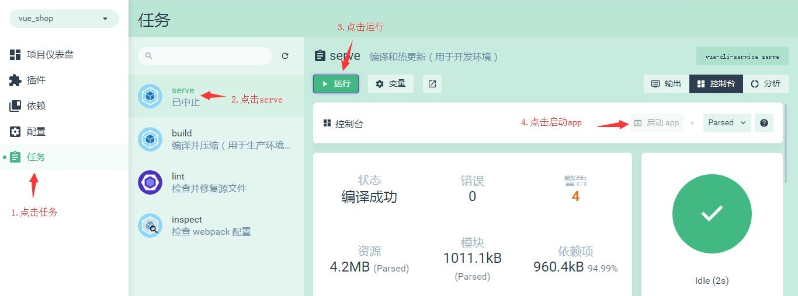

#一.电商业务概述
客户使用的业务服务：PC端，小程序，移动web，移动app
管理员使用的业务服务：PC后台管理端。
PC后台管理端的功能：管理用户账号（登录，退出，用户管理，权限管理），商品管理（商品分类，分类参数，商品信息，订单），数据统计
电商后台管理系统采用前后端分离的开发模式
前端项目是基于Vue的SPA（单页应用程序）项目

前端技术栈:Vue,Vue-Router,Element-UI,Axios,Echarts
后端技术栈：Node.js,Express,Jwt(模拟session),Mysql,Sequelize(操作数据库的框架)

#二.项目初始化
A.安装Vue脚手架
B.通过脚手架创建项目
C.配置路由
D.配置Element-UI:在插件中安装，搜索vue-cli-plugin-element
E.配置Axios：在依赖中安装,搜索axios(运行依赖)
F.初始化git仓库
G.将本地项目托管到github

```
git init
git add .
git commit -m "first commit"
git remote add origin https://github.com/de-Lovey/project2020.git
git push -u origin master
```


#三.配置后台项目
A.打开sqlyog并导入mysql数据库数据    

```jade
步骤 : 打开sqlyog -> 新建数据库名mydb -->选中数据库名  -->复制mysql.sql里的内容, 粘贴到右边面板并执行所有
```

​	注意 :  一定要启动mysql服务器  打开cmd : net start  mysql

​	注意 : 若提示`服务名无效`,  则找到mysql> bin目录中, 打开cmd  输入: mysqld --install 再测试就好了

B.安装nodeJS，配置后台项目,从终端打开后台项目vue_api_server
然后在终端中输入命令安装项目依赖包：npm install

C.使用postman测试api接口


#四.实现登录功能
A.登录状态保持
如果服务器和客户端同源，建议可以使用cookie或者session来保持登录状态
如果客户端和服务器跨域了，建议使用token进行维持登录状态。

##### token原理分析


B.登录逻辑：
在登录页面输入账号和密码进行登录，将数据发送给服务器
服务器返回登录的结果，登录成功则返回数据中带有token
客户端得到token并进行保存，后续的请求都需要将此token发送给服务器，服务器会验证token以保证用户身份。


然后执行vue ui命令打开ui界面，然后运行serve，运行app查看当前项目效果


发现现在是一个默认页面，我们需要进行更改，打开项目的src目录，点击main.js文件（入口文件）
```
import Vue from 'vue'
import App from './App.vue'
import router from './router'
import './plugins/element.js'

Vue.config.productionTip = false


new Vue({
  router,
  render: h => h(App)
}).$mount('#app')

```
再打开App.vue(根组件)，将根组件的内容进行操作梳理(template中留下根节点，script中留下默认导出，去掉组件，style中去掉所有样式)
```
<template>
  <div id="app">
    <router-view></router-view>
  </div>
</template>

<script>
export default {
  name: 'app'
}
</script>

<style>
</style>
```
再打开router.js(路由)，将routes数组中的路由规则清除，然后将views删除，将components中的helloworld.vue删除
```
import Vue from 'vue'
import Router from 'vue-router'

Vue.use(Router)

export default new Router({
  routes: [
    
  ]
})
```
在components文件夹中新建Login.vue组件,添加template，script，style标签,style标签中的scoped可以防止组件之间的样式冲突，没有scoped则样式是全局的
```
<template>
    <div class="login_container">
        
    </div>
</template>

<script>
export default {
  
}
</script>

<style lang="less" scoped>
.login_container {
  background-color: #2b5b6b;
  height: 100%;
}

</style>
```
在router.js中导入组件并设置规则
在App.vue中添加路由占位符
```
const router = new Router({
  routes: [
    { path: '/', redirect: '/login' },
    { path: '/login', component: Login }
  ]
})
```

当我们给Login.vue中的内容添加样式的时候，会报错“缺少less-loader”，需要配置less加载器（开发依赖），安装less(开发依赖)

然后需要添加公共样式，在assets文件夹下面添加css文件夹，创建global.css文件,添加全局样式
```
/* 全局样式表 */
html,body,#app{
    width: 100%;
    height: 100%;
    margin: 0;
    padding: 0; 
}
```
在main.js中导入global.css，使得全局样式生效 import "./assets/css/global.css"
然后Login.vue中的根元素也需要设置撑满全屏（height:100%）
最终Login.vue文件中的代码如下
```
<template>
    <div class="login_container">
        <!-- 登录盒子  -->
        <div class="login_box">
            <!-- 头像 -->
            <div class="avatar_box">
                
            </div>
            <!-- 登录表单 -->
            <el-form :model="loginForm" ref="LoginFormRef" :rules="loginFormRules" label-width="0px" class="login_form">
                <!-- 用户名 -->
                <el-form-item prop="username">
                    <el-input v-model="loginForm.username" prefix-icon="iconfont icon-user" ></el-input>
                </el-form-item> 
                <!-- 密码 -->
                <el-form-item prop="password">
                    <el-input type="password" v-model="loginForm.password" prefix-icon="iconfont icon-3702mima"></el-input>
                </el-form-item> 
                <!-- 按钮 -->
                <el-form-item class="btns">
                    <el-button type="primary" @click="login">登录</el-button>
                    <el-button type="info" @click="resetLoginForm">重置</el-button>
                </el-form-item> 
            </el-form>
        </div>
    </div>
</template>

<script>
export default {
  data() {
    return {
      //数据绑定
      loginForm: {
        username: 'admin',
        password: '123456'
      },
      //表单验证规则
      loginFormRules: {
        username: [
          { required: true, message: '请输入登录名', trigger: 'blur' },
          {
            min: 3,
            max: 10,
            message: '登录名长度在 3 到 10 个字符',
            trigger: 'blur'
          }
        ],
        password: [
          { required: true, message: '请输入密码', trigger: 'blur' },
          {
            min: 6,
            max: 15,
            message: '密码长度在 6 到 15 个字符',
            trigger: 'blur'
          }
        ]
      }
    }
  },
  //添加行为，
  methods: {
    //添加表单重置方法
    resetLoginForm() {
      //this=>当前组件对象，其中的属性$refs包含了设置的表单ref
      //   console.log(this)
      this.$refs.LoginFormRef.resetFields()
    },
    login() {
      //点击登录的时候先调用validate方法验证表单内容是否有误
      this.$refs.LoginFormRef.validate(async valid => {
        console.log(this.loginFormRules)
        //如果valid参数为true则验证通过
        if (!valid) {
          return
        }

        //发送请求进行登录
        const { data: res } = await this.$http.post('login', this.loginForm)
        //   console.log(res);
        if (res.meta.status !== 200) {
          return this.$message.error('登录失败:' + res.meta.msg) //console.log("登录失败:"+res.meta.msg)
        }

        this.$message.success('登录成功')
        console.log(res)
        //保存token
        window.sessionStorage.setItem('token', res.data.token)
        // 导航至/home
        this.$router.push('/home')
      })
    }
  }
}
</script>

<style lang="less" scoped>
.login_container {
  background-color: #2b5b6b;
  height: 100%;
}
.login_box {
  width: 450px;
  height: 300px;
  background: #fff;
  border-radius: 3px;
  position: absolute;
  left: 50%;
  top: 50%;
  transform: translate(-50%, -50%);
  .avatar_box {
    height: 130px;
    width: 130px;
    border: 1px solid #eee;
    border-radius: 50%;
    padding: 10px;
    box-shadow: 0 0 10px #ddd;
    position: absolute;
    left: 50%;
    transform: translate(-50%, -50%);
    background-color: #fff;
    img {
      width: 100%;
      height: 100%;
      border-radius: 50%;
      background-color: #eee;
    }
  }
}
.login_form {
  position: absolute;
  bottom: 0;
  width: 100%;
  padding: 0 20px;
  box-sizing: border-box;
}
.btns {
  display: flex;
  justify-content: flex-end;
}
</style>

```

其中我们有用到一下内容，需要进行进一步处理：

A.添加element-ui的表单组件
在plugins文件夹中打开element.js文件，进行elementui的按需导入
import Vue from 'vue'
import { Button } from 'element-ui'
import { Form, FormItem } from 'element-ui'
import { Input } from 'element-ui'

Vue.use(Button)
Vue.use(Form)
Vue.use(FormItem)
Vue.use(Input)

B.添加第三方字体
复制素材中的fonts文件夹到assets中,在入口文件main.js中导入import './assets/fonts/iconfont.css'
然后直接在 <el-input prefix-icon="iconfont icon-3702mima"></el-input>
接着添加登录盒子

C.添加表单验证的步骤
1).给<el-form>添加属性:rules="rules"，rules是一堆验证规则，定义在script、中
2).在script中添加rules：export default{ data(){return{......, rules: {
          name: [
            { required: true, message: '请输入活动名称', trigger: 'blur' },
            { min: 3, max: 5, message: '长度在 3 到 5 个字符', trigger: 'blur' }
          ],
          region: [
            { required: true, message: '请选择活动区域', trigger: 'change' }
          ]
}......
3).通过<el-form-item>的prop属性设置验证规则<el-form-item label="活动名称" prop="name">

4.导入axios以发送ajax请求
打开main.js，import axios from 'axios';
设置请求的根路径：axios.defaults.baseURL = 'http://127.0.0.1:8888/api/private/v1/';
挂载axios：Vue.prototype.$http = axios;

5.配置弹窗提示：
在plugins文件夹中打开element.js文件，进行elementui的按需导入
import {Message} from 'element-ui'
进行全局挂载：Vue.prototype.$message = Message;
在login.vue组件中编写弹窗代码：this.$message.error('登录失败')


### 登录成功之后的操作
A.登录成功之后，需要将后台返回的token保存到sessionStorage中
操作完毕之后，需要跳转到/home
```
login() {
      //点击登录的时候先调用validate方法验证表单内容是否有误
      this.$refs.LoginFormRef.validate(async valid => {
        console.log(this.loginFormRules)
        //如果valid参数为true则验证通过
        if (!valid) {
          return
        }

        //发送请求进行登录
        const { data: res } = await this.$http.post('login', this.loginForm)
        //   console.log(res);
        if (res.meta.status !== 200) {
          return this.$message.error('登录失败:' + res.meta.msg) //console.log("登录失败:"+res.meta.msg)
        }

        this.$message.success('登录成功')
        console.log(res)
        //保存token
        window.sessionStorage.setItem('token', res.data.token)
        // 导航至/home
        this.$router.push('/home')
      })
    }
```
添加一个组件Home.vue，并为之添加规则
```
<template>
    <div>
        this is home
        <el-button type="info" @click="logout"> 退出 </el-button>
    </div>
</template>

<script>
export default {
  methods: {
    logout() {
      window.sessionStorage.clear()
      this.$router.push('/login')
    }
  }
}
</script>

<style lang='less' scoped>
</style>
```
添加路由规则
```
const router = new Router({
  routes: [
    { path: '/', redirect: '/login' },
    { path: '/login', component: Login },
    { path: '/home', component: Home }
  ]
})
```


添加路由守卫
如果用户没有登录，不能访问/home,如果用户通过url地址直接访问，则强制跳转到登录页面
打开router.js
```
import Vue from 'vue'
import Router from 'vue-router'
import Login from './components/Login.vue'
import Home from './components/Home.vue'

Vue.use(Router)

const router = new Router({
  routes: [
    { path:'/', redirect:'/login'},
    { path:'/login' , component:Login },
    { path:'/home' , component:Home}
  ]
})

//挂载路由导航守卫,to表示将要访问的路径，from表示从哪里来，next是下一个要做的操作
router.beforeEach((to,from,next)=>{ 
  if(to.path === '/login')
    return next();
  
  //获取token
  const tokenStr = window.sessionStorage.getItem('token');

  if(!tokenStr)
    return next('/login');

  next();

})

export default router 
```

实现退出功能
在Home组件中添加一个退出功能按钮,给退出按钮添加点击事件，添加事件处理代码如下：
```
export default {
    methods:{
        logout(){
            window.sessionStorage.clear();
            this.$router.push('/login');
        }
    }
}
```

###补充
A.处理ESLint警告
打开脚手架面板，查看警告信息
[图片]
默认情况下，ESLint和vscode格式化工具有冲突，需要添加配置文件解决冲突。
在项目根目录添加 .prettierrc 文件
```
{
    "semi":false,
    "singleQuote":true
}
```
打开.eslintrc.js文件，禁用对 space-before-function-paren 的检查:
```
  rules: {
    'no-console': process.env.NODE_ENV === 'production' ? 'error' : 'off',
    'no-debugger': process.env.NODE_ENV === 'production' ? 'error' : 'off',
    'space-before-function-paren' : 0
  },
```

B.合并按需导入的element-ui
```
import Vue from 'vue'
import { Button, Form, FormItem, Input, Message } from 'element-ui'

Vue.use(Button)
Vue.use(Form)
Vue.use(FormItem)
Vue.use(Input)
// 进行全局挂载：
Vue.prototype.$message = Message
```


## 

# 五.实现首页需求

1.实现后台首页的基本布局
2.实现左侧菜单栏
3.实现用户列表展示
4.实现添加用户

### 1.后台首页基本布局

打开Home.vue组件，进行布局：

```
<el-container class="home-container">
  <!-- 头部区域 -->
  <el-header>Header<el-button type="info" @click="logout"> 退出 </el-button></el-header>
  <!-- 页面主体区域 -->
  <el-container>
    <!-- 侧边栏 -->
    <el-aside width="200px">Aside</el-aside>
    <!-- 主体结构 -->
    <el-main>Main</el-main>
  </el-container>
</el-container>
```

默认情况下，跟element-ui组件同名的类名可以帮助我们快速的给对应的组件添加样式，如：

```
.home-container {
  height: 100%;
}
.el-header{
  background-color:#373D41;
}
.el-aside{
  background-color:#333744;
}
.el-main{
  background-color:#eaedf1;
}
```

### 2.顶部布局，侧边栏布局

```
<template>
    <el-container class="home-container">
      <!-- 头部区域 -->
      <el-header>
        <div>
          <!-- 黑马logo -->
          
          <!-- 顶部标题 -->
          <span>电商后台管理系统</span>
        </div>
        <el-button type="info" @click="logout"> 退出 </el-button>
      </el-header>
      <!-- 页面主体区域 -->
      <el-container>
        <!-- 侧边栏 -->
        <el-aside width="200px">
          <!-- 侧边栏菜单 -->
          <el-menu
            background-color="#333744"
            text-color="#fff"
            active-text-color="#ffd04b">
            <!-- 一级菜单 -->
            <el-submenu index="1">
              <!-- 一级菜单模板 -->
              <template slot="title">
                <!-- 图标 -->
                <i class="el-icon-location"></i>
                <!-- 文本 -->
                <span>导航一</span>
              </template>
              <!-- 二级子菜单 -->
              <el-menu-item index="1-1">
                <!-- 二级菜单模板 -->
                <template slot="title">
                  <!-- 图标 -->
                  <i class="el-icon-location"></i>
                  <!-- 文本 -->
                  <span>子菜单一</span>
                </template>
              </el-menu-item>
            </el-submenu>
            
          </el-menu>
        </el-aside>
        <!-- 主体结构 -->
        <el-main>Main</el-main>
      </el-container>
    </el-container>
</template>
```

### 3.axios请求拦截器

后台除了登录接口之外，都需要token权限验证，我们可以通过添加axios请求拦截器来添加token，以保证拥有获取数据的权限
在main.js中添加代码，在将axios挂载到vue原型之前添加下面的代码

```
//请求在到达服务器之前，先会调用use中的这个回调函数来添加请求头信息
axios.interceptors.request.use(config=>{
  //为请求头对象，添加token验证的Authorization字段
  config.headers.Authorization = window.sessionStorage.getItem("token")
  return config
})
```

### 4.请求侧边栏数据

```
<script>
export default {
  data() {
    return {
      // 左侧菜单数据
      menuList: null
    }
  },
  created() {
    // 在created阶段请求左侧菜单数据
    this.getMenuList()
  },
  methods: {
    logout() {
      window.sessionStorage.clear()
      this.$router.push('/login')
    },
    async getMenuList() {
      // 发送请求获取左侧菜单数据
      const { data: res } = await this.$http.get('menus')
      if (res.meta.status !== 200) return this.$message.error(res.meta.msg)
      this.menuList = res.data
    }
  }
}
</script>
```

通过v-for双重循环渲染左侧菜单

```
<el-menu
  background-color="#333744"
  text-color="#fff"
  active-text-color="#ffd04b">
  <!-- 一级菜单 -->
  <el-submenu :index="item.id+''" v-for="item in menuList" :key="item.id">
    <!-- 一级菜单模板 -->
    <template slot="title">
      <!-- 图标 -->
      <i class="el-icon-location"></i>
      <!-- 文本 -->
      <span>{{item.authName}}</span>
    </template>
    <!-- 二级子菜单 -->
    <el-menu-item :index="subItem.id+''" v-for="subItem in item.children" :key="subItem.id">
      <!-- 二级菜单模板 -->
      <template slot="title">
        <!-- 图标 -->
        <i class="el-icon-location"></i>
        <!-- 文本 -->
        <span>{{subItem.authName}}</span>
      </template>
    </el-menu-item>
  </el-submenu>
</el-menu>
```

### 5.设置激活子菜单样式

通过更改el-menu的active-text-color属性可以设置侧边栏菜单中点击的激活项的文字颜色
通过更改菜单项模板（template）中的i标签的类名，可以将左侧菜单栏的图标进行设置，我们需要在项目中使用第三方字体图标
在数据中添加一个iconsObj：

```
iconsObj: {
        '125':'iconfont icon-user',
        '103':'iconfont icon-tijikongjian',
        '101':'iconfont icon-shangpin',
        '102':'iconfont icon-danju',
        '145':'iconfont icon-baobiao'
      }
```

然后将图标类名进行数据绑定，绑定iconsObj中的数据：

为了保持左侧菜单每次只能打开一个，显示其中的子菜单，我们可以在el-menu中添加一个属性unique-opened
或者也可以数据绑定进行设置(此时true认为是一个bool值，而不是字符串) :unique-opened="true"

### 6.制作侧边菜单栏的伸缩功能

在菜单栏上方添加一个div

```
        <!-- 侧边栏,宽度根据是否折叠进行设置 -->
        <el-aside :width="isCollapse ? '64px':'200px'">
          <!-- 伸缩侧边栏按钮 -->
          <div class="toggle-button" @click="toggleCollapse">|||</div>
          <!-- 侧边栏菜单，:collapse="isCollapse"（设置折叠菜单为绑定的 isCollapse 值），:collapse-transition="false"（关闭默认的折叠动画） -->
          <el-menu
          :collapse="isCollapse"
          :collapse-transition="false"
          ......
```

然后给div添加样式，给div添加事件：
<div class="toggle-button" @click="this.isCollapse ? '64px':'200px'">|||</div>

### 7.在后台首页添加子级路由

新增子级路由组件Welcome.vue
在router.js中导入子级路由组件，并设置路由规则以及子级路由的默认重定向
打开Home.vue，在main的主体结构中添加一个路由占位符

制作好了Welcome子级路由之后，我们需要将所有的侧边栏二级菜单都改造成子级路由链接
我们只需要将el-menu的router属性设置为true就可以了，此时当我们点击二级菜单的时候，就会根据菜单的index
属性进行路由跳转,如: /110,
使用index id来作为跳转的路径不合适，我们可以重新绑定index的值为  :index="'/'+subItem.path"

### 8.完成用户列表主体区域

新建用户列表组件  user/Users.vue
在router.js中导入子级路由组件Users.vue，并设置路由规则

当点击二级菜单的时候，被点击的二级子菜单并没有高亮，我们需要正在被使用的功能高亮显示
我们可以通过设置el-menu的default-active属性来设置当前激活菜单的index
但是default-active属性也不能写死，固定为某个菜单值
所以我们可以先给所有的二级菜单添加点击事件,并将path值作为方法的参数
@click="saveNavState('/'+subItem.path)"
在saveNavState方法中将path保存到sessionStorage中
saveNavState( path ){
  //点击二级菜单的时候保存被点击的二级菜单信息
  window.sessionStorage.setItem("activePath",path);
  this.activePath = path;
}
然后在数据中添加一个activePath绑定数据，并将el-menu的default-active属性设置为activePath
最后在created中将sessionStorage中的数据赋值给activePath
this.activePath = window.sessionStorage.getItem("activePath")

### 9.绘制用户列表基本结构

A.使用element-ui面包屑组件完成顶部导航路径(复制面包屑代码，在element.js中导入组件Breadcrumb,BreadcrumbItem)
B.使用element-ui卡片组件完成主体表格(复制卡片组件代码，在element.js中导入组件Card)，再使用element-ui输入框完成搜索框及搜索按钮，
此时我们需要使用栅格布局来划分结构(复制卡片组件代码，在element.js中导入组件Row，Col)，然后再使用el-button制作添加用户按钮

```
<div>
    <h3>用户列表组件</h3>
    <!-- 面包屑导航 -->
    <el-breadcrumb separator="/">
        <el-breadcrumb-item :to="{ path: '/home' }">首页</el-breadcrumb-item>
        <el-breadcrumb-item>用户管理</el-breadcrumb-item>
        <el-breadcrumb-item>用户列表</el-breadcrumb-item>
    </el-breadcrumb>
    <!-- 卡片视图区域 -->
    <el-card>
        <!-- 搜索与添加区域 -->
        <el-row :gutter="20">
            <el-col :span="7">
                <el-input placeholder="请输入内容">
                    <el-button slot="append" icon="el-icon-search"></el-button>
                </el-input> 
            </el-col>
            <el-col :span="4">
                <el-button type="primary">添加用户</el-button>
            </el-col>
        </el-row> 
    </el-card>
</div>
```

### 10.请求用户列表数据

```
<script>
export default {
  data() {
    return {
      //获取查询用户信息的参数
      queryInfo: {
        query: '',
        pagenum: 1,
        pagesize: 2
      },
      //保存请求回来的用户列表数据
      userList:[],
      total:0
    }
  },
  created() {
    this.getUserList()
  },
  methods: {
    async getUserList() {
      //发送请求获取用户列表数据
      const { res: data } = await this.$http.get('users', {
        params: this.queryInfo
      })
      //如果返回状态为异常状态则报错并返回
      if (res.meta.status !== 200)
        return this.$message.error('获取用户列表失败')
      //如果返回状态正常，将请求的数据保存在data中
      this.userList = res.data.users;
      this.total = res.data.total;
    }
  }
}
</script>
```

### 11.将用户列表数据展示

使用表格来展示用户列表数据，使用element-ui表格组件完成列表展示数据(复制表格代码，在element.js中导入组件Table,TableColumn)
在渲染展示状态时，会使用作用域插槽获取每一行的数据
再使用switch开关组件展示状态信息(复制开关组件代码，在element.js中导入组件Switch)
而渲染操作列时，也是使用作用域插槽来进行渲染的，
在操作列中包含了修改，删除，分配角色按钮，当我们把鼠标放到分配角色按钮上时
希望能有一些文字提示，此时我们需要使用文字提示组件(复制文字提示组件代码，在element.js中导入组件Tooltip),将分配角色按钮包含
代码结构如下：

```
<!-- 用户列表(表格)区域 -->
<el-table :data="userList" border stripe>
    <el-table-column type="index"></el-table-column>
    <el-table-column label="姓名" prop="username"></el-table-column>
    <el-table-column label="邮箱" prop="email"></el-table-column>
    <el-table-column label="电话" prop="mobile"></el-table-column>
    <el-table-column label="角色" prop="role_name"></el-table-column>
    <el-table-column label="状态">
        <template slot-scope="scope">
            <el-switch v-model="scope.row.mg_state"></el-switch>
        </template>
    </el-table-column>
    <el-table-column label="操作" width="180px">
        <template slot-scope="scope">
            <!-- 修改 -->
            <el-button type="primary" icon="el-icon-edit" size='mini'></el-button>
            <!-- 删除 -->
            <el-button type="danger" icon="el-icon-delete" size='mini'></el-button>
            <!-- 分配角色 -->
            <el-tooltip class="item" effect="dark" content="分配角色" placement="top" :enterable="false">
                <el-button type="warning" icon="el-icon-setting" size='mini'></el-button>
            </el-tooltip>
        </template>
    </el-table-column>
</el-table>
```

### 12.实现用户列表分页

A.使用表格来展示用户列表数据，可以使用分页组件完成列表分页展示数据(复制分页组件代码，在element.js中导入组件Pagination)
B.更改组件中的绑定数据

```
<!-- 分页导航区域 
@size-change(pagesize改变时触发) 
@current-change(页码发生改变时触发)
:current-page(设置当前页码)
:page-size(设置每页的数据条数)
:total(设置总页数) -->
            <el-pagination @size-change="handleSizeChange" @current-change="handleCurrentChange" :current-page="queryInfo.pagenum" :page-sizes="[1, 2, 5, 10]" :page-size="queryInfo.pagesize" layout="total, sizes, prev, pager, next, jumper" :total="total">
            </el-pagination>
```

C.添加两个事件的事件处理函数@size-change，@current-change

```
handleSizeChange(newSize) {
  //pagesize改变时触发，当pagesize发生改变的时候，我们应该
  //以最新的pagesize来请求数据并展示数据
  //   console.log(newSize)
  this.queryInfo.pagesize = newSize;
  //重新按照pagesize发送请求，请求最新的数据
  this.getUserList();  
},
handleCurrentChange( current ) {
  //页码发生改变时触发当current发生改变的时候，我们应该
  //以最新的current页码来请求数据并展示数据
  //   console.log(current)
  this.queryInfo.pagenum = current;
  //重新按照pagenum发送请求，请求最新的数据
  this.getUserList();  
}
```

### 13.实现更新用户状态

当用户点击列表中的switch组件时，用户的状态应该跟随发生改变。
A.首先监听用户点击switch组件的事件，并将作用域插槽的数据当做事件参数进行传递

```
<el-switch v-model="scope.row.mg_state" @change="userStateChanged(scope.row)"></el-switch>
```

B.在事件中发送请求完成状态的更改

```
async userStateChanged(row) {
  //发送请求进行状态修改
  const { data: res } = await this.$http.put(
    `users/${row.id}/state/${row.mg_state}`
  )
  //如果返回状态为异常状态则报错并返回
  if (res.meta.status !== 200) {
    row.mg_state = !row.mg_state
    return this.$message.error('修改状态失败')
  }
  this.$message.success('更新状态成功')
},
```

### 14.实现搜索功能

添加数据绑定，添加搜索按钮的点击事件(当用户点击搜索按钮的时候，调用getUserList方法根据文本框内容重新请求用户列表数据)
当我们在输入框中输入内容并点击搜索之后，会按照搜索关键字搜索，我们希望能够提供一个X删除搜索关键字并重新获取所有的用户列表数据，只需要给文本框添加clearable属性并添加clear事件，在clear事件中重新请求数据即可

```
<el-col :span="7">
    <el-input placeholder="请输入内容" v-model="queryInfo.query" clearable @clear="getUserList">
        <el-button slot="append" icon="el-icon-search" @click="getUserList"></el-button>
    </el-input>
</el-col>
```

### 15.实现添加用户

A.当我们点击添加用户按钮的时候，弹出一个对话框来实现添加用户的功能，首先我们需要复制对话框组件的代码并在element.js文件中引入Dialog组件

B.接下来我们要为“添加用户”按钮添加点击事件，在事件中将addDialogVisible设置为true，即显示对话框

C.更改Dialog组件中的内容

```
<!-- 对话框组件  :visible.sync(设置是否显示对话框) width(设置对话框的宽度)
:before-close(在对话框关闭前触发的事件) -->
<el-dialog title="添加用户" :visible.sync="addDialogVisible" width="50%">
    <!-- 对话框主体区域 -->
    <el-form :model="addForm" :rules="addFormRules" ref="addFormRef" label-width="70px">
        <el-form-item label="用户名" prop="username">
            <el-input v-model="addForm.username"></el-input>
        </el-form-item>
        <el-form-item label="密码" prop="password">
            <el-input v-model="addForm.password"></el-input>
        </el-form-item>
        <el-form-item label="邮箱" prop="email">
            <el-input v-model="addForm.email"></el-input>
        </el-form-item>
        <el-form-item label="电话" prop="mobile">
            <el-input v-model="addForm.mobile"></el-input>
        </el-form-item>
    </el-form>
    <!-- 对话框底部区域 -->
    <span slot="footer" class="dialog-footer">
        <el-button @click="addDialogVisible = false">取 消</el-button>
        <el-button type="primary" @click="addDialogVisible = false">确 定</el-button>
    </span>
</el-dialog>
```

D.添加数据绑定和校验规则：

```
data() {
  //验证邮箱的规则
  var checkEmail = (rule, value, cb) => {
    const regEmail = /^\w+@\w+(\.\w+)+$/
    if (regEmail.test(value)) {
      return cb()
    }
    //返回一个错误提示
    cb(new Error('请输入合法的邮箱'))
  }
  //验证手机号码的规则
  var checkMobile = (rule, value, cb) => {
    const regMobile = /^1[34578]\d{9}$/
    if (regMobile.test(value)) {
      return cb()
    }
    //返回一个错误提示
    cb(new Error('请输入合法的手机号码'))
  }
  return {
    //获取查询用户信息的参数
    queryInfo: {
      // 查询的条件
      query: '',
      // 当前的页数，即页码
      pagenum: 1,
      // 每页显示的数据条数
      pagesize: 2
    },
    //保存请求回来的用户列表数据
    userList: [],
    total: 0,
    //是否显示添加用户弹出窗
    addDialogVisible: false,
    // 添加用户的表单数据
    addForm: {
      username: '',
      password: '',
      email: '',
      mobile: ''
    },
    // 添加表单的验证规则对象
    addFormRules: {
      username: [
        { required: true, message: '请输入用户名称', trigger: 'blur' },
        {
          min: 3,
          max: 10,
          message: '用户名在3~10个字符之间',
          trigger: 'blur'
        }
      ],
      password: [
        { required: true, message: '请输入密码', trigger: 'blur' },
        {
          min: 6,
          max: 15,
          message: '用户名在6~15个字符之间',
          trigger: 'blur'
        }
      ],
      email: [
          { required: true, message: '请输入邮箱', trigger: 'blur' },
          { validator:checkEmail, message: '邮箱格式不正确，请重新输入', trigger: 'blur'}
      ],
      mobile: [
          { required: true, message: '请输入手机号码', trigger: 'blur' },
          { validator:checkMobile, message: '手机号码不正确，请重新输入', trigger: 'blur'}
      ]
    }
  }
}
```

E.当关闭对话框时，重置表单
给el-dialog添加@close事件，在事件中添加重置表单的代码

```
methods:{
  ....
  addDialogClosed(){
      //对话框关闭之后，重置表达
      this.$refs.addFormRef.resetFields();
  }
}
```

F.点击对话框中的确定按钮，发送请求完成添加用户的操作
首先给确定按钮添加点击事件，在点击事件中完成业务逻辑代码

```
methods:{
  ....
  addUser(){
      //点击确定按钮，添加新用户
      //调用validate进行表单验证
      this.$refs.addFormRef.validate( async valid => {
          if(!valid) return this.$message.error("请填写完整用户信息");
          //发送请求完成添加用户的操作
          const {data:res} = await this.$http.post("users",this.addForm)
          //判断如果添加失败，就做提示
          if (res.meta.status !== 200)
              return this.$message.error('添加用户失败')
          //添加成功的提示
          this.$message.success("添加用户成功")
          //关闭对话框
          this.addDialogVisible = false
          //重新请求最新的数据
          this.getUserList()
      })
  }
}
```


### 16.修改用户信息

A.为用户列表中的修改按钮绑定点击事件
B.在页面中添加修改用户对话框，并修改对话框的属性
C.根据id查询需要修改的用户数据

```
//展示编辑用户的对话框
async showEditDialog(id) {
    //发送请求根据id获取用户信息
    const { data: res } = await this.$http.get('users/' + id)
    //判断如果添加失败，就做提示
    if (res.meta.status !== 200) return this.$message.error('获取用户信息失败')
    //将获取到的数据保存到数据editForm中
    this.editForm = res.data
    //显示弹出窗
    this.editDialogVisible = true
}
```

D.在弹出窗中添加修改用户信息的表单并做响应的数据绑定以及数据验证

```
<!-- 对话框主体区域 -->
<el-form :model="editForm" :rules="editFormRules" ref="editFormRef" label-width="70px">
    <el-form-item label="用户名">
        <el-input v-model="editForm.username" disabled></el-input>
    </el-form-item>
    <el-form-item label="邮箱" prop="email">
        <el-input v-model="editForm.email"></el-input>
    </el-form-item>
    <el-form-item label="电话" prop="mobile">
        <el-input v-model="editForm.mobile"></el-input>
    </el-form-item>
</el-form>
```

数据绑定以及验证：

```
//控制修改用户对话框的显示与否
editDialogVisible: false,
//修改用户的表单数据
editForm: {
    username: '',
    email: '',
    mobile: ''
},
//修改表单的验证规则对象
editFormRules: {
    email: [
        { required: true, message: '请输入邮箱', trigger: 'blur' },
        {
        validator: checkEmail,
        message: '邮箱格式不正确，请重新输入',
        trigger: 'blur'
        }
    ],
    mobile: [
        { required: true, message: '请输入手机号码', trigger: 'blur' },
        {
        validator: checkMobile,
        message: '手机号码不正确，请重新输入',
        trigger: 'blur'
        }
    ]
}
```

E.监听对话框关闭事件，在对话框关闭之后，重置表单

```
<el-dialog title="修改用户" :visible.sync="editDialogVisible" width="50%" @close="editDialogClosed">

editDialogClosed(){
    //对话框关闭之后，重置表达
    this.$refs.editFormRef.resetFields()
}
```

F.在用户点击确定按钮的时候，验证数据成功之后发送请求完成修改

```
editUser() {
    //用户点击修改表单中的确定按钮之后，验证表单数据
    this.$refs.editFormRef.validate(async valid => {
    if (!valid) return this.$message.error('请填写完整用户信息')
    //发送请求完成修改用户的操作
    const { data: res } = await this.$http.put(
        'users/' + this.editForm.id,
        this.editForm
    )
    //判断如果修改失败，就做提示
    if (res.meta.status !== 200) return this.$message.error('修改用户失败')
    //修改成功的提示
    this.$message.success('修改用户成功')
    //关闭对话框
    this.editDialogVisible = false
    //重新请求最新的数据
    this.getUserList()
    })
}
```

### 17.删除用户

在点击删除按钮的时候，我们应该跳出提示信息框，让用户确认要进行删除操作。
如果想要使用确认取消提示框，我们需要先将提示信息框挂载到vue中。
A.导入MessageBox组件，并将MessageBox组件挂载到实例。
Vue.prototype.$confirm = MessageBox.confirm
B.给用户列表中的删除按钮添加事件，并在事件处理函数中弹出确定取消窗,最后再根据id发送删除用户的请求

```
async removeUserById(id){
    //弹出确定取消框，是否删除用户
    const confirmResult = await this.$confirm('请问是否要永久删除该用户','删除提示',{
    confirmButtonText:'确认删除',
    cancelButtonText:'取消',
    type:'warning'
    }).catch(err=>err)
    //如果用户点击确认，则confirmResult 为'confirm'
    //如果用户点击取消, 则confirmResult获取的就是catch的错误消息'cancel'
    if(confirmResult != "confirm"){
        return this.$message.info("已经取消删除")
    }
    //发送请求根据id完成删除操作
    const {data:res} = await this.$http.delete('users/'+id)
    //判断如果删除失败，就做提示
    if (res.meta.status !== 200) return this.$message.error('删除用户失败')
    //修改成功的提示
    this.$message.success('删除用户成功')
    //重新请求最新的数据
    this.getUserList()
}
```

### 18.推送代码

创建user子分支，并将代码推送到码云
A.创建user子分支  git checkout -b user
B.将代码添加到暂存区 git add .
C.将代码提交并注释 git commit -m '添加完成用户列表功能'
D.将本地的user分支推送到码云 git push -u origin user
E.将user分支代码合并到master:
切换到master   git checkout master
合并user       git merge user
F.将本地master分支的代码推送到码云  git push

创建rights子分支
A.创建rights子分支 git checkout -b rights
B.将本地的rights分支推送到码云 git push -u origin rights

### 19.权限列表

#### A.添加权限列表路由

创建权限管理组件（Rights.vue），并在router.js添加对应的路由规则

```
import Rights from './components/power/Rights.vue'
......
      path: '/home', component: Home, redirect: '/welcome', children: [
        { path: "/welcome", component: Welcome },
        { path: "/users", component: Users },
        { path: "/rights", component: Rights }
      ]
......
```

#### B.添加面包屑导航

在Rights.vue中添加面包屑组件展示导航路径

#### C.显示数据

在data中添加一个rightsList数据，在methods中提供一个getRightsList方法发送请求获取权限列表数据，在created中调用这个方法获取数据

```
<el-table :data="rightsList" stripe>
    <el-table-column type="index"></el-table-column>
    <el-table-column label="权限名称" prop="authName"></el-table-column>
    <el-table-column label="路径" prop="path"></el-table-column>
    <el-table-column label="权限等级" prop="level">
        <template slot-scope="scope"> 
            <el-tag v-if="scope.row.level === 0">一级权限</el-tag>
            <el-tag v-if="scope.row.level === 1" type="success">二级权限</el-tag>
            <el-tag v-if="scope.row.level === 2" type="warning">三级权限</el-tag>
        </template>
    </el-table-column>
</el-table>
<script>
export default {
    data(){
        return {
            //列表形式的权限
            rightsList:[]
        }
    },
    created(){
        this.getRightsList();
    },
    methods:{
        async getRightsList(){
            const {data:res} = await this.$http.get('rights/list')
            //如果返回状态为异常状态则报错并返回
            if (res.meta.status !== 200)
                return this.$message.error('获取权限列表失败')
            //如果返回状态正常，将请求的数据保存在data中
            this.rightsList = res.data
        }
    }
}
</script>
```

### 20.角色列表

#### A.添加角色列表路由

添加角色列表子组件（power/Roles.vue），并添加对应的规则

```
path: '/home', component: Home, redirect: '/welcome', children: [
        { path: "/welcome", component: Welcome },
        { path: "/users", component: Users },
        { path: "/rights", component: Rights },
        { path: "/roles", component: Roles  }
      ]
```

#### B.添加面包屑导航

在Roles.vue中添加面包屑组件展示导航路径

#### C.显示数据

在data中添加一个roleList数据，在methods中提供一个getRoleList方法发送请求获取权限列表数据，在created中调用这个方法获取数据

```
<!-- 角色列表区域 -->
<!-- row-key="id" 是2019年3月提供的新特性，
if there's nested data, rowKey is required.
如果这是一个嵌套的数据，rowkey 是必须添加的属性 -->
<el-table row-key="id" :data="roleList" border>
    <!-- 添加展开列 -->
    <el-table-column type="expand"></el-table-column>
    <el-table-column type="index"></el-table-column>
    <el-table-column label="角色名称" prop="roleName"></el-table-column>
    <el-table-column label="角色描述" prop="roleDesc"></el-table-column>
    <el-table-column label="操作" width="300px">
        <template slot-scope="scope"> 
            <el-button size="mini" type="primary" icon="el-icon-edit">编辑</el-button>
            <el-button size="mini" type="danger" icon="el-icon-delete">删除</el-button>
            <el-button size="mini" type="warning" icon="el-icon-setting">分配权限</el-button>
        </template>
    </el-table-column>
</el-table>

<script>
export default {
    data(){
        return {
            roleList:[]
        }
    },created(){
        this.getRoleList();
    },methods:{
        async getRoleList(){
            const {data:res} = await this.$http.get('roles')
            //如果返回状态为异常状态则报错并返回
            // if (res.meta.status !== 200)
            //     return this.$message.error('获取角色列表失败')
            // //如果返回状态正常，将请求的数据保存在data中
            // this.roleList = res.data
            console.log(res.data)
            this.roleList = res.data;
        }
    }
}
</script>
```

#### D.补充说明

之前学习过类似的添加角色，删除角色，编辑角色请参照之前编写过的代码还有接口文档完成效果。

#### E.生成权限列表

使用三重嵌套for循环生成权限下拉列表

```
<!-- 添加展开列 -->
<el-table-column type="expand">
    <template slot-scope="scope">
        <el-row :class="['bdbottom',i1===0?'bdtop':'']" v-for="(item1,i1) in scope.row.children" :key="item1.id">
            <!-- 渲染一级权限 -->
            <el-col :span="5">
                <el-tag>
                    {{item1.authName}}
                </el-tag>
                <i class="el-icon-caret-right"></i>
            </el-col>
            <!-- 渲染二，三级权限 -->
            <el-col :span="19">
                <!-- 通过for循环嵌套渲染二级权限  -->
                <el-row :class="[i2===0?'':'bdtop' ]" v-for="(item2,i2) in item1.children" :key="item2.id">
                    <el-col :span="6">
                        <el-tag type="success">{{item2.authName}}</el-tag>
                        <i class="el-icon-caret-right"></i>
                    </el-col>
                    <el-col :span="18">
                        <el-tag type="warning" v-for="(item3) in item2.children" :key="item3.id">
                            {{item3.authName}}
                        </el-tag>
                    </el-col>
                </el-row>
            </el-col>
        </el-row>
    </template>
</el-table-column>
```

#### F.美化样式

通过设置global.css中的#app样式min-width:1366px 解决三级权限换行的问题
，通过给一级权限el-row添加display:flex,align-items:center的方式解决一级权限垂直居中的问题，二级权限也类似添加，因为需要给多个内容添加，可以将这个样式设置为一个.vcenter{display:flex;align-items:center}

#### G.添加权限删除功能

给每一个权限的el-tag添加closable属性，是的权限右侧出现“X”图标
再给el-tag添加绑定close事件处理函数removeRightById(scope.row,item1.id)
removeRightById(scope.row,item2.id)
removeRightById(scope.row,item3.id)

```
async removeRightById(role,rightId){
    //弹窗提示用户是否要删除
    const confirmResult = await this.$confirm('请问是否要删除该权限','删除提示',{
        confirmButtonText:'确认删除',
        cancelButtonText:'取消',
        type:'warning'
    }).catch(err=>err)
    //如果用户点击确认，则confirmResult 为'confirm'
    //如果用户点击取消, 则confirmResult获取的就是catch的错误消息'cancel'
    if(confirmResult != "confirm"){
        return this.$message.info("已经取消删除")
    }

    //用户点击了确定表示真的要删除
    //当发送delete请求之后，返回的数据就是最新的角色权限信息
    const {data:res} = await this.$http.delete(`roles/${role.id}/rights/${rightId}`)
    if (res.meta.status !== 200)
        return this.$message.error('删除角色权限失败')

    //无需再重新加载所有权限
    //只需要对现有的角色权限进行更新即可
    role.children = res.data
    // this.getRoleList();

}
```

#### H.完成权限分配功能

先给分配权限按钮添加事件
<el-button size="mini" type="warning" icon="el-icon-setting" @click="showSetRightDialog">分配权限</el-button>
在showSetRightDialog函数中请求权限树数据并显示对话框

```
async showSetRightDialog() {
    //当点击分配权限按钮时，展示对应的对话框
    this.setRightDialogVisible = true;
    //获取所有权限的数据
    const {data:res} = await this.$http.get('rights/tree')
    //如果返回状态为异常状态则报错并返回
    if (res.meta.status !== 200)
        return this.$message.error('获取权限树失败')
    //如果返回状态正常，将请求的数据保存在data中
    this.rightsList = res.data
}
```

添加分配权限对话框，并添加绑定数据setRightDialogVisible
<!-- 分配权限对话框 -->
<el-dialog title="分配权限" :visible.sync="setRightDialogVisible" width="50%">
    <span>这是一段信息</span>
    <span slot="footer" class="dialog-footer">
        <el-button @click="setRightDialogVisible = false">取 消</el-button>
        <el-button type="primary" @click="setRightDialogVisible = false">确 定</el-button>
    </span>
</el-dialog>

#### I.完成树形结构弹窗

在element.js中引入Tree，注册Tree

```
<!-- 分配权限对话框 -->
<el-dialog title="分配权限" :visible.sync="setRightDialogVisible" width="50%" @close="setRightDialogClose">
    <!-- 树形组件
    show-checkbox:显示复选框
    node-key:设置选中节点对应的值
    default-expand-all:是否默认展开所有节点
    :default-checked-keys 设置默认选中项的数组
    ref:设置引用 -->
    <el-tree :data="rightsList" :props="treeProps" show-checkbox node-key="id" default-expand-all :default-checked-keys="defKeys" ref="treeRef"></el-tree>
    <span slot="footer" class="dialog-footer">
        <el-button @click="setRightDialogVisible = false">取 消</el-button>
        <el-button type="primary" @click="allotRights">确 定</el-button>
    </span>
</el-dialog>

<script>
export default {
  data() {
    return {
      //角色列表数据
      roleList: [],
      //控制分配权限对话框的显示
      setRightDialogVisible: false,
      //权限树数据
      rightsList: [],
      //树形控件的属性绑定对象
      treeProps: {
        //通过label设置树形节点文本展示authName
        label: 'authName',
        //设置通过children属性展示子节点信息
        children: 'children'
      },
      //设置树形控件中默认选中的内容
      defKeys: [],
      //保存正在操作的角色id
      roleId:''
    }
  },
  created() {
    this.getRoleList()
  },
  methods: {
    async getRoleList() {
      const { data: res } = await this.$http.get('roles')
      //如果返回状态为异常状态则报错并返回
      if (res.meta.status !== 200)
        return this.$message.error('获取角色列表失败')
      //如果返回状态正常，将请求的数据保存在data中
      // this.roleList = res.data
      console.log(res.data)
      this.roleList = res.data
    },
    async removeRightById(role, rightId) {
      //弹窗提示用户是否要删除
      const confirmResult = await this.$confirm(
        '请问是否要删除该权限',
        '删除提示',
        {
          confirmButtonText: '确认删除',
          cancelButtonText: '取消',
          type: 'warning'
        }
      ).catch(err => err)
      //如果用户点击确认，则confirmResult 为'confirm'
      //如果用户点击取消, 则confirmResult获取的就是catch的错误消息'cancel'
      if (confirmResult != 'confirm') {
        return this.$message.info('已经取消删除')
      }

      //用户点击了确定表示真的要删除
      //当发送delete请求之后，返回的数据就是最新的角色权限信息
      const { data: res } = await this.$http.delete(
        `roles/${role.id}/rights/${rightId}`
      )
      if (res.meta.status !== 200)
        return this.$message.error('删除角色权限失败')

      //无需再重新加载所有权限
      //只需要对现有的角色权限进行更新即可
      role.children = res.data
      // this.getRoleList();
    },
    async showSetRightDialog(role) {
      //将role.id保存起来以供保存权限时使用
      this.roleId = role.id;  
      //获取所有权限的数据
      const { data: res } = await this.$http.get('rights/tree')
      //如果返回状态为异常状态则报错并返回
      if (res.meta.status !== 200) return this.$message.error('获取权限树失败')
      //如果返回状态正常，将请求的数据保存在data中
      this.rightsList = res.data

      //调用getLeafKeys进行递归，将三级权限添加到数组中
      this.getLeafKeys(role, this.defKeys)
      //当点击分配权限按钮时，展示对应的对话框
      this.setRightDialogVisible = true
      console.log(this.defKeys)
    },
    getLeafKeys(node, arr) {
      //该函数会获取到当前角色的所有三级权限id并添加到defKeys中
      //如果当前节点不包含children属性，则表示node为三级权限
      if (!node.children) {
        return arr.push(node.id)
      }
      //递归调用
      node.children.forEach(item => this.getLeafKeys(item, arr))
    },
    setRightDialogClose() {
      //当用户关闭树形权限对话框的时候，清除掉所有选中状态
      this.defKeys = []
    },
    async allotRights() {
      //当用户在树形权限对话框中点击确定，将用户选择的
      //权限发送请求进行更新

      //获取所有选中及半选的内容
      const keys = [
        ...this.$refs.treeRef.getCheckedKeys(),
        ...this.$refs.treeRef.getHalfCheckedKeys()
      ]
      //将数组转换为 , 拼接的字符串
      const idStr = keys.join(',')

      //发送请求完成更新
      const { data: res } = await this.$http.post(
        `roles/${this.roleId}/rights`,
        { rids:idStr }
      )
      if (res.meta.status !== 200)
        return this.$message.error('分配权限失败')

      this.$message.success("分配权限成功")
      this.getRoleList();
      //关闭对话框
      this.setRightDialogVisible = false;
    }
  }
}
</script>
```

### 21.分配角色

打开Users.vue，完成分配角色的功能
A.添加分配角色对话框

```
<!-- 分配角色对话框 -->
<el-dialog title="分配角色" :visible.sync="setRoleDialogVisible" width="50%">
    <div>
    <p>当前的用户:{{userInfo.username}}</p>
    <p>当前的角色:{{userInfo.role_name}}</p>
    <p>分配新角色:</p>
    </div>
    <span slot="footer" class="dialog-footer">
    <el-button @click="setRoleDialogVisible = false">取 消</el-button>
    <el-button type="primary" @click="setRoleDialogVisible = false">确 定</el-button>
    </span>
</el-dialog>
```

B.给分配角色按钮添加点击事件，点击之后弹出一个对话框进行角色分配

```
<!-- 分配角色 -->
<el-tooltip class="item" effect="dark" content="分配角色" placement="top" :enterable="false">
    <el-button type="warning" icon="el-icon-setting" size='mini' @click="setRole(scope.row)"></el-button>
</el-tooltip>

data(){
    ......
    //控制显示分配角色对话框
    setRoleDialogVisible:false,
    //保存正在操作的那个用户信息
    userInfo:{},
    //保存所有的角色信息
    rolesList:[],
    //保存用户选中的角色id
    selectedRoleId:''
},
methods:{
    ......
    async setRole( userInfo ){
      //保存起来以供后续使用
      this.userInfo = userInfo;
      //获取所有的角色信息，以备下拉列表使用
      //发送请求根据id完成删除操作
      const { data: res } = await this.$http.get('roles')
      //判断如果删除失败，就做提示
      if (res.meta.status !== 200) return this.$message.error('获取角色列表失败')
      
      this.rolesList = res.data;
      //展示分配角色对话框
      this.setRoleDialogVisible = true;

      
    }
}
```

C.在element.js中引入Select，Option，注册Select，Option

```
<!-- 角色选择下拉框
v-model：设置用户选中角色之后的id绑定数据
-->
<el-select v-model="selectedRoleId" placeholder="请选择角色">
<!-- :label 显示文本，:value 选中值 -->
<el-option v-for="item in rolesList" :key="item.id" :label="item.roleName" :value="item.id">
</el-option>
</el-select>
```

D.当用户点击对话框中的确定之后，完成分配角色的操作

```
<!-- 分配角色对话框 -->
<el-dialog title="分配角色" :visible.sync="setRoleDialogVisible" width="50%" @close="setRoleDialogClosed">
    <div>
    <p>当前的用户:{{userInfo.username}}</p>
    <p>当前的角色:{{userInfo.role_name}}</p>
    <p>分配新角色:
        <!-- 角色选择下拉框
        v-model：设置用户选中角色之后的id绑定数据
        -->
        <el-select v-model="selectedRoleId" placeholder="请选择角色">
        <!-- :label 显示文本，:value 选中值 -->
        <el-option v-for="item in rolesList" :key="item.id" :label="item.roleName" :value="item.id">
        </el-option>
        </el-select>
    </p>
    </div>
    <span slot="footer" class="dialog-footer">
    <el-button @click="setRoleDialogVisible = false">取 消</el-button>
    <el-button type="primary" @click="saveRoleInfo">确 定</el-button>
    </span>
</el-dialog>


methods:{
    .......
    async saveRoleInfo(){
      //当用户点击确定按钮之后
      //判断用户是否选择了需要分配的角色
      if(!this.selectedRoleId){
        return this.$message.error('请选择需要分配的角色')
      }
      //发送请求完成分配角色的操作
      const {data:res} = await this.$http.put(`users/${this.userInfo.id}/role`,{rid:this.selectedRoleId})

      //判断如果删除失败，就做提示
      if (res.meta.status !== 200)
        return this.$message.error('分配角色失败')

      this.$message.success('分配角色成功')
      this.getUserList();
      //关闭对话框
      this.setRoleDialogVisible = false
    },
    setRoleDialogClosed(){
      //当关闭对话框的时候，重置下拉框中的内容
      this.selectedRoleId = ''
      this.userInfo = {}
    }
}
```

### 22.将代码推送到码云

A.将代码推送到暂存区 git add .
B.将代码提交到仓库 git commit -m '完成了权限功能开发'
C.将rights分支代码推送到码云 git push
D.将代码合并到master 
    git checkout master
    git merge rights
E.将master代码推送到码云
    git push


## 

### 23.商品分类

#### A.新建分支goods_cate

新建分支goods_cate并推送到码云
git checkout -b goods_cate
git push -u origin goods_cate

#### B.创建子级路由

创建categories子级路由组件并设置路由规则

```
import Cate from './components/goods/Cate.vue'

path: '/home', component: Home, redirect: '/welcome', children: [
    { path: "/welcome", component: Welcome },
    { path: "/users", component: Users },
    { path: "/rights", component: Rights },
    { path: "/roles", component: Roles  },
    { path: "/categories", component: Cate  }
]
```

#### C.添加组件基本布局

在Cate.vue组件中添加面包屑导航以及卡片视图中的添加分类按钮

```
<template>
    <div>
        <h3>商品分类</h3>
        <!-- 面包屑导航 -->
        <el-breadcrumb separator="/">
            <el-breadcrumb-item :to="{ path: '/home' }">首页</el-breadcrumb-item>
            <el-breadcrumb-item>商品管理</el-breadcrumb-item>
            <el-breadcrumb-item>商品分类</el-breadcrumb-item>
        </el-breadcrumb>
        <!-- 卡片视图区域 -->
        <el-card>
            <!-- 添加分类按钮区域 -->
            <el-row>
                <el-col>
                    <el-button type="primary">添加分类</el-button>
                </el-col>
            </el-row>
            <!-- 分类表格  -->

            <!-- 分页 -->
        </el-card>
    </div>
</template>
```

#### D.请求分类数据

请求分类数据并将数据保存在data中

```
<script>
export default {
  data() {
    return {
      // 商品分类数据列表
      cateList: [],
      //查询分类数据的条件
      queryInfo: {
        type: 3,
        pagenum: 1,
        pagesize: 5
      },
      //保存总数据条数
      total: 0
    }
  },
  created() {
    this.getCateList()
  },
  methods: {
    async getCateList() {
      //获取商品分类数据
      const { data: res } = await this.$http.get('categories', {
        params: queryInfo
      })

      if (res.meta.status !== 200) {
        return this.$message.error('获取商品列表数据失败')
      }
      //将数据列表赋值给cateList
      this.cateList = res.data.result
      //保存总数据条数
      this.total = res.data.total
      //   console.log(res.data);
    }
  }
}
</script>
```

#### E.使用插件展示数据

使用第三方插件vue-table-with-tree-grid展示分类数据
    1).在vue 控制台中点击依赖->安装依赖->运行依赖->输入vue-table-with-tree-gird->点击安装
    2).打开main.js，导入vue-table-with-tree-grid
    import TreeTable from 'vue-table-with-tree-grid'
    .....
    Vue.config.productionTip = false

```
//全局注册组件
Vue.component('tree-table', TreeTable)
3).使用组件展示分类数据
```

```
<!-- 分类表格
:data(设置数据源) :columns(设置表格中列配置信息) :selection-type(是否有复选框)
:expand-type(是否展开数据) show-index(是否设置索引列) index-text(设置索引列头)
border(是否添加纵向边框) :show-row-hover(是否鼠标悬停高亮) -->
<tree-table :data="cateList" :columns="columns" :selection-type="false"
:expand-type="false" show-index index-text="#" border :show-row-hover="false">

</tree-table>

在数据中添加columns:
columns: [
    {label:'分类名称',prop:'cat_name'}
]
```

#### F.自定义数据列

使用vue-table-with-tree-grid定义模板列并添加自定义列

```
//先在columns中添加一个列
columns: [
    {label:'分类名称',prop:'cat_name'},
    //type:'template'(将该列设置为模板列)，template:'isok'(设置该列模板的名称为isok)
    {label:'是否有效',prop:'',type:'template',template:'isok'},
    {label:'排序',prop:'',type:'template',template:'order'},
    {label:'操作',prop:'',type:'template',template:'opt'}
]

<!-- 是否有效区域， 设置对应的模板列： slot="isok"(与columns中设置的template一致) -->
<template slot="isok" slot-scope="scope">
  <i class="el-icon-success" v-if="scope.row.cat_deleted === false" style="color:lightgreen"></i>
  <i class="el-icon-error" v-else style="color:red"></i>
</template>
<!-- 排序 -->
<template slot="order" slot-scope="scope">
  <el-tag size="mini" v-if="scope.row.cat_level===0">一级</el-tag>
  <el-tag size="mini" type="success" v-else-if="scope.row.cat_level===1">二级</el-tag>
  <el-tag size="mini" type="warning" v-else>三级</el-tag>
</template>

<!-- 操作 -->
<template slot="opt" slot-scope="scope">
  <el-button size="mini" type="primary" icon="el-icon-edit">编辑</el-button>
  <el-button size="mini" type="danger" icon="el-icon-delete">删除</el-button> 
</template>
```

#### G.完成分页功能

```
<!-- 分页 -->
<el-pagination @size-change="handleSizeChange" @current-change="handleCurrentChange" :current-page="queryInfo.pagenum" :page-sizes="[3, 5, 10, 15]" :page-size="queryInfo.pagesize" layout="total, sizes, prev, pager, next, jumper" :total="total">
</el-pagination>

//添加对应的事件函数
methods:{
  .......
  handleSizeChange(newSize){
    //当pagesize发生改变时触发
    this.queryInfo.pagesize = newSize;
    this.getCateList();
  },
  handleCurrentChange(newPage){
    //当pagenum发生改变时触发
    this.queryInfo.pagenum = newPage;
    this.getCateList();
  }
}
```

#### H.完成添加分类

```
......
<!-- 添加分类按钮区域 -->
<el-row>
  <el-col>
    <el-button type="primary" @click="showAddCateDialog">添加分类</el-button>
  </el-col>
</el-row>
......
<!-- 添加分类对话框 -->
<el-dialog title="添加分类" :visible.sync="addCateDialogVisible" width="50%"  @close="addCateDialogClosed">
  <!-- 添加分类表单 -->
  <el-form :model="addCateForm" :rules="addCateFormRules" ref="addCateFormRuleForm" label-width="100px">
    <el-form-item label="分类名称" prop="cat_name">
      <el-input v-model="addCateForm.cat_name"></el-input>
    </el-form-item>
    <el-form-item label="父级分类" prop="cat_pid">
      
    </el-form-item>
  </el-form>
  <span slot="footer" class="dialog-footer">
    <el-button @click="addCateDialogVisible = false">取 消</el-button>
    <el-button type="primary" @click="addCate">确 定</el-button>
  </span>
</el-dialog>


//用来显示或隐藏添加分类对话框
addCateDialogVisible: false,
//添加分类的表单数据对象
addCateForm:{
  //分类名称
  cat_name:'',
  //添加分类的父级id，0则表示父级为0.添加一级分类
  cat_pid:0,
  //添加分类的等级，0则表示添加一级分类
  cat_level:0
},
//添加分类校验规则
addCateFormRules:{
  //验证规则
  cat_name:[ {required:true , message:'请输入分类名称',trigger:'blur'} ]
},
//保存1,2级父级分类的列表
parentCateList:[]
.......
showAddCateDialog() {
  //调用getParentCateList获取分类列表
  this.getParentCateList()
  //显示添加分类对话框
  this.addCateDialogVisible = true
},
async getParentCateList(){
  //获取父级分类数据列表
  const { data: res } = await this.$http.get('categories', {
    params: {type:2}
  })

  if (res.meta.status !== 200) {
    return this.$message.error('获取商品分类列表数据失败')
  }
  this.parentCateList = res.data
}
```

添加级联菜单显示父级分类
先导入Cascader组件，并注册
然后添加使用级联菜单组件：

```
<el-form-item label="父级分类" prop="cat_pid">
  <!-- expandTrigger='hover'(鼠标悬停触发级联) v-model(设置级联菜单绑定数据) :options(指定级联菜单数据源)  :props(用来配置数据显示的规则) 
  clearable(提供“X”号完成删除文本功能) change-on-select(是否可以选中任意一级的菜单) -->
  <el-cascader expandTrigger='hover' v-model="selectedKeys" :options="parentCateList" :props="cascaderProps" @change="parentCateChange" clearable change-on-select></el-cascader>
</el-form-item>

添加数据
//配置级联菜单中数据如何展示
cascaderProps:{
  value:'cat_id',
  label:'cat_name',
  children:'children',
  expandTrigger:'hover'
},
//绑定用户选择的分类值
selectedKeys:[]
.....
methods:{
  .....
  parentCateChange(){
    //级联菜单中选择项发生变化时触发
    console.log(this.selectedKeys)
    //如果用户选择了父级分类
    if(this.selectedKeys.length > 0){
      //则将数组中的最后一项设置为父级分类
      this.addCateForm.cat_pid = this.selectedKeys[this.selectedKeys.length - 1]
      //level也要跟着发生变化
      this.addCateForm.cat_level = this.selectedKeys.length
      return
    }else{
      this.addCateForm.cat_pid = 0
      this.addCateForm.cat_level = 0
      return
    }
  },
  addCateDialogClosed(){
    //当关闭添加分类对话框时，重置表单
    this.$refs.addCateFormRef.resetFields()
    this.selectedKeys = [];
    this.addCateForm.cat_pid = 0
    this.addCateForm.cat_level = 0
  },
  addCate() {
    //点击确定，完成添加分类
    console.log(this.addCateForm)
    this.$refs.addCateFormRef.validate(async valid => {
      if (!valid) return
      //发送请求完成添加分类
      const { data: res } = await this.$http.post(
        'categories',
        this.addCateForm
      )

      if (res.meta.status !== 201) {
        return this.$message.error('添加分类失败')
      }

      this.$message.success('添加分类成功')
      this.getCateList()
      this.addCateDialogVisible = false
    })
  }
}

```

#### I.推送代码

制作完添加分类之后，将代码提交到仓库，推送到码云,将goods_cate分支合并到master
git add .
git commit -m '完成商品分类'
git push
git checkout master
git merge goods_cate

### 24.参数管理


动态参数 : 共用户选择的信息

静态属性 : 商品固定的参数

注 :  只允许给三级分类内容设置参数，参数分为动态参数和静态参数属性

#### A.添加子级组件

添加Params.vue子组件，并在router.js中引入该组件并设置路由规则

```
import Params from './components/goods/Params.vue'
......
path: '/home', component: Home, redirect: '/welcome', children: [
  { path: "/welcome", component: Welcome },
  { path: "/users", component: Users },
  { path: "/rights", component: Rights },
  { path: "/roles", component: Roles  },
  { path: "/categories", component: Cate  },
  { path: "/params", component: Params  }
]
```

#### B.完成组件基本布局

完成Params.vue组件的基本布局
其中警告提示信息使用了el-alert，在element.js引入该组件并注册

```
<template>
    <div>
        <h3>分类参数</h3>
        <!-- 面包屑导航 -->
        <el-breadcrumb separator="/">
            <el-breadcrumb-item :to="{ path: '/home' }">首页</el-breadcrumb-item>
            <el-breadcrumb-item>商品管理</el-breadcrumb-item>
            <el-breadcrumb-item>分类参数</el-breadcrumb-item>
        </el-breadcrumb>
        <!-- 卡片视图区域 -->
        <el-card>
            <!-- 警告区域 :closable="false"(是否展示“X”号) show-icon(显示图标) -->
            <el-alert title="注意：只允许为第三级分类设置相关参数" type="warning" :closable="false" show-icon>
            </el-alert>

            <!-- 选择商品分类区域 -->
            <el-row class="cat_opt">
                <el-col>
                    <span>选择商品分类：</span>
                    <!-- 选择商品分类的级联选择框 -->
                </el-col>
                <el-col></el-col>
            </el-row>
        </el-card>
    </div>
</template>
```

#### C.完成级联选择框

完成商品分类级联选择框

```
<!-- 选择商品分类区域 -->
<el-row class="cat_opt">
    <el-col>
        <span>选择商品分类：</span>
        <!-- 选择商品分类的级联选择框 -->
        <el-cascader expandTrigger='hover' v-model="selectedCateKeys" :options="cateList" :props="cateProps" @change="handleChange" clearable></el-cascader>
    </el-col>
    <el-col></el-col>
</el-row>
......
<script>
export default {
  data() {
    return {
        //分类列表
        cateList:[],
        //用户在级联下拉菜单中选中的分类id
        selectedCateKeys:[],
        //配置级联菜单中数据如何展示
        cateProps: {
            value: 'cat_id',
            label: 'cat_name',
            children: 'children'
        }
    }
  },
  created() {
      this.getCateList()
  },
  methods: {
      async getCateList(){
        //获取所有的商品分类列表
        const { data: res } = await this.$http.get('categories')

        if (res.meta.status !== 200) {
            return this.$message.error('获取分类数据失败')
        }
        //将数据列表赋值给cateList
        this.cateList = res.data
        // //保存总数据条数
        // this.total = res.data.total
        //   console.log(res.data);
      },
      handleChange(){
        //当用户在级联菜单中选择内容改变时触发
        console.log(this.selectedCateKeys);
      }
  }
}
</script>
```

#### D.展示参数

展示动态参数数据以及静态属性数据

```
<!-- tab页签区域 -->
<el-tabs v-model="activeName" @tab-click="handleTabClick">
  <!-- 添加动态参数的面板 将标签页改为many -->
  <el-tab-pane label="动态参数" name="many">
    <el-button size="mini" type="primary" :disabled="isButtonDisabled">添加参数</el-button>
    <!-- 动态参数表格 -->
    <el-table :data="manyTableData" border stripe>
      <!-- 展开行 -->
      <el-table-column type="expand"></el-table-column>
      <!-- 索引列 -->
      <el-table-column type="index"></el-table-column>
      <el-table-column label="参数名称" prop="attr_name"></el-table-column>
      <el-table-column label="操作">
        <template slot-scope="scope">
          <el-button size="mini" type="primary" icon="el-icon-edit">编辑</el-button>
          <el-button size="mini" type="danger" icon="el-icon-delete">删除</el-button>
        </template>
      </el-table-column>
    </el-table>
  </el-tab-pane>
  <!-- 添加静态属性的面板 将标签页改为only -->
  <el-tab-pane label="静态属性" name="only">
    <el-button size="mini" type="primary" :disabled="isButtonDisabled">添加属性</el-button>
    <!-- 静态属性表格 -->
    <el-table :data="onlyTableData" border stripe>
      <!-- 展开行 -->
      <el-table-column type="expand"></el-table-column>
      <!-- 索引列 -->
      <el-table-column type="index"></el-table-column>
      <el-table-column label="属性名称" prop="attr_name"></el-table-column>
      <el-table-column label="操作">
        <template slot-scope="scope">
          <el-button size="mini" type="primary" icon="el-icon-edit">编辑</el-button>
          <el-button size="mini" type="danger" icon="el-icon-delete">删除</el-button>
        </template>
      </el-table-column>
    </el-table>
  </el-tab-pane>

</el-tabs>


<script>
export default {
  data() {
    return {
      ......
      //tab页签激活显示的页签项
      activeName: 'many',
      //用来保存动态参数数据
      manyTableData: [],
      //用来保存静态属性数据
      onlyTableData: []  
    }
  methods: {
    .......
    async handleChange() {
      //当用户在级联菜单中选择内容改变时触发
      console.log(this.selectedCateKeys)
      //发送请求，根据用户选择的三级分类和面板获取参数数据
      const { data: res } = await this.$http.get(
        `categories/${this.cateId}/attributes`,
        { params: { sel: this.activeName } }
      )
      if (res.meta.status !== 200) {
        return this.$message.error('获取参数列表数据失败')
      }

      console.log(res.data)
      if (this.activeName === 'many') {
        //获取的是动态参数
        this.manyTableData = res.data
      } else if (this.activeName === 'only') {
        //获取的是静态属性
        this.onlyTableData = res.data
      }
    },
    handleTabClick() {
      console.log(this.activeName)
      this.handleChange()
    }
  },
  computed: {
    //添加计算属性用来获取按钮禁用与否
    isButtonDisabled() {
      return this.selectedCateKeys.length !== 3
    },
    //获取选中的三级分类id
    cateId() {
      if (this.selectedCateKeys.length === 3) {
        return this.selectedCateKeys[this.selectedCateKeys.length - 1]
      }
      return null
    }
  }
```

#### E.添加参数

完成添加参数或属性

```
<!-- 添加参数或属性对话框 -->
<el-dialog :title="'添加'+titleText" :visible.sync="addDialogVisible" width="50%" @close="addDialogClosed">
  <!-- 添加表单 -->
  <el-form :model="addForm" :rules="addFormRules" ref="addFormRef" label-width="100px">
    <el-form-item :label="titleText" prop="attr_name">
      <el-input v-model="addForm.attr_name"></el-input>
    </el-form-item>
  </el-form>
  <span slot="footer" class="dialog-footer">
    <el-button @click="addDialogVisible = false">取 消</el-button>
    <el-button type="primary" @click="addParams">确 定</el-button>
  </span>
</el-dialog>

export default {
  data() {
    return {
      .......
      //控制添加参数.属性对话框的显示或隐藏
      addDialogVisible: false,
      //添加参数的表单数据对象
      addForm: {
        attr_name: ''
      },
      //添加表单验证规则
      addFormRules: {
        attr_name: [{ required: true, message: '请输入名称', trigger: 'blur' }]
      }
    }
  },methods: {
    .......
    addParams() {
      //当用户点击对话框中的确定时，校验表单
      this.$refs.addFormRef.validate(async valid => {
        //校验不通过，return
        if (!valid) return
        //校验通过，发送请求完成添加参数或者属性
        const { data: res } = this.$http.post(`categories/${this.cateId}/attributes`,
          { 
            attr_name: this.addForm.attr_name, 
            attr_sel: this.activeName,
            attr_vals: "a,b,c" 
          }
        )

        console.log(res)
        if (res.meta.status !== 201) {
          return this.$message.error('添加' + this.titleText + '数据失败')
        }
        this.$message.success('添加' + this.titleText + '数据成功')
        this.addDialogVisible = false
        this.getCateList()
      })
    }
  }
```

#### F.编辑参数

完成编辑参数或属性

```
<!-- 修改参数或属性对话框 -->
<el-dialog :title="'修改'+titleText" :visible.sync="editDialogVisible" width="50%" @close="editDialogClosed">
  <!-- 添加表单 -->
  <el-form :model="editForm" :rules="editFormRules" ref="editFormRef" label-width="100px">
    <el-form-item :label="titleText" prop="attr_name">
      <el-input v-model="editForm.attr_name"></el-input>
    </el-form-item>
  </el-form>
  <span slot="footer" class="dialog-footer">
    <el-button @click="editDialogVisible = false">取 消</el-button>
    <el-button type="primary" @click="editParams">确 定</el-button>
  </span>
</el-dialog>

export default {
  data() {
    return {
      .......
      //控制修改参数.属性对话框的显示或隐藏
      editDialogVisible:false,
      //修改参数.属性对话框中的表单
      editForm:{
        attr_name:''
      },
      //修改表单的验证规则
      editFormRules:{
        attr_name:[
          { required: true, message: '请输入名称', trigger: 'blur' }
        ]
      }
    }
  },methods: {
    .......
    async showEditDialog(attr_id){
      //发起请求获取需要修改的那个参数数据
      const {data:res} = await this.$http.get(`categories/${this.cateId}/attributes/${attr_id}`,
      {params:{ attr_sel:this.activeName }})
      if (res.meta.status !== 200) {
        return this.$message.error('获取参数数据失败')
      }
      this.editForm = res.data;
      //显示修改参数.属性对话框
      this.editDialogVisible = true;
    },
    editDialogClosed(){
      //当关闭修改参数.属性对话框时
      this.$refs.editFormRef.resetFields()
    },
    editParams(){
      //验证表单
      this.$refs.editFormRef.validate(async valid => {
        if(!valid) return;

        //发送请求完成修改
        const {data:res} = await this.$http.put(`categories/${this.cateId}/attributes/${this.editForm.attr_id}`,
        {attr_name:this.editForm.attr_name,attr_sel:this.activeName})

        if (res.meta.status !== 200) {
          return this.$message.error('获取参数数据失败')
        }
        this.$message.success('修改' + this.titleText + '数据成功')
        this.editDialogVisible = false
        this.handleChange();
      })
    }
  }
```

#### G.删除参数

删除参数或属性

```
给两个删除按钮添加事件
<el-button size="mini" type="danger" icon="el-icon-delete" @click="removeParams(scope.row.attr_id)">删除</el-button>
<el-button size="mini" type="danger" icon="el-icon-delete" @click="removeParams(scope.row.attr_id)">删除</el-button>

添加对应的事件处理函数
async removeParams(attr_id){
  //根据id删除对应的参数或属性
  //弹窗提示用户是否要删除
  const confirmResult = await this.$confirm(
    '请问是否要删除该'+this.titleText,
    '删除提示',
    {
      confirmButtonText: '确认删除',
      cancelButtonText: '取消',
      type: 'warning'
    }
  ).catch(err => err)
  //如果用户点击确认，则confirmResult 为'confirm'
  //如果用户点击取消, 则confirmResult获取的就是catch的错误消息'cancel'
  if (confirmResult != 'confirm') {
    return this.$message.info('已经取消删除')
  }

  //没有取消就是要删除，发送请求完成删除
  const {data:res} = await this.$http.delete(`categories/${this.cateId}/attributes/${attr_id}`)

  if (res.meta.status !== 200) {
    return this.$message.error('删除参数数据失败')
  }
  this.$message.success('删除' + this.titleText + '数据成功')
  this.handleChange()
}
```


### 

#### H.展示动态参数可选项

动态参数可选项展示及操作
在获取动态参数的方法中进行处理。

```
//将获取到的数据中的attr_vals字符串转换为数组
res.data.forEach(item => {
  item.attr_vals = item.attr_vals ? item.attr_vals.split(' ') : []
  //添加一个bool值控制文本框的显示或者隐藏
  item.inputVisible = false
  //添加一个inputValue保存文本框值
  item.inputValue = ''
})

//然后再修改展开行中的代码，生成el-tag和文本框以及添加按钮
<!-- 展开行 -->
<el-table-column type="expand">
  <template slot-scope="scope">
    <!-- 循环生成的el-tag -->
    <el-tag v-for="(item,i) in scope.row.attr_vals" :key="i" closable>{{item}}</el-tag>
    <!-- 输入框 -->
    <el-input class="input-new-tag" v-if="scope.row.inputVisible" v-model="scope.row.inputValue" ref="saveTagInput" size="small" @keyup.enter.native="handleInputConfirm(scope.row)" @blur="handleInputConfirm(scope.row)">
    </el-input>
    <!-- 添加按钮 -->
    <el-button v-else class="button-new-tag" size="small" @click="showInput(scope.row)">+ New Tag</el-button>
  </template>
</el-table-column>


//最后对应文本框的事件和按钮的事件添加处理函数
handleInputConfirm(row){
  //当用户在文本框中按下enter键或者焦点离开时都会触发执行
  //判断用户在文本框中输入的内容是否合法
  if(row.inputValue.trim().length===0){
    row.inputValue = ''
    row.inputVisible = false
    return
  }

  // row.inputVisible = false
  //如果用户输入了真实合法的数据，需要保存起来
},
showInput(row){
  //用户点击添加按钮时触发
  row.inputVisible = true
  //$nextTick:在页面上元素被重新渲染之后，调用回调函数的代码
  this.$nextTick(_=>{
    //让文本框自动获得焦点
    this.$refs.saveTagInput.$refs.input.focus()
  })
}
```

#### I.添加/删除可选项

添加/删除动态参数可选项

```
给el-tag添加删除事件
<el-tag v-for="(item,i) in scope.row.attr_vals" :key="i" closable @close="handleClose(i,scope.row)">{{item}}</el-tag>

在methods中添加新增，删除事件处理函数
handleInputConfirm(row){
  //当用户在文本框中按下enter键或者焦点离开时都会触发执行
  //判断用户在文本框中输入的内容是否合法
  if(row.inputValue.trim().length===0){
    row.inputValue = ''
    row.inputVisible = false
    return
  }

  // row.inputVisible = false
  //如果用户输入了真实合法的数据，需要保存起来
  row.attr_vals.push(row.inputValue.trim())
  row.inputValue = ''
  row.inputVisible = false

  this.saveAttrVals(row)
},
handleClose(index,row){
  //删除对应索引的参数可选项
  row.attr_vals.splice(index,1)
  //调用函数，完成保存可选项的操作
  this.saveAttrVals(row)
},
async saveAttrVals(row){
  //封装函数，完成保存可选项的操作
  //发起请求，保存参数细项
  const {data:res} = await this.$http.put(`categories/${this.cateId}/attributes/${row.attr_id}`,
  {attr_name:row.attr_name,attr_sel:row.attr_sel,attr_vals:row.attr_vals.join(' ')})

  if (res.meta.status !== 200) {
    return this.$message.error('修改参数项失败')
  }

  this.$message.success('修改参数项成功')
}
```

补充：当用户在级联选择框中选中了非三级分类时，需要清空表格中数据

```
async handleChange() {
      //如果用户选择的不是三级分类
      if(this.selectedCateKeys.length !== 3){
        this.selectedCateKeys = []
        this.manyTableData = []
        this.onlyTableData = []
        return
      }
      ......
```

补充2：当完成了动态参数可选项的功能之后，我们也需要一样的方式完成静态属性可选项的功能。

此时我们只需要将动态参数可选项中的展开行复制到静态属性的表格中即可

### 25.推送代码到码云

添加到暂存求： git add .
提交到本地仓库：  git commit -m '完成了分类参数开发'
推送到码云：  git push
切换到master ： git checkout master
合并到master ： git merge goods_params

创建商品列表子分支
git checkout -b goods_list
推送至码云 git push -u origin goods_list

### 26.商品列表

#### A.制作商品列表基本结构

添加子级路由组件以及对应的规则,并设置组件的基本机构
打开router.js,添加下面的代码

```
import GoodList from './components/goods/List.vue'

path: '/home', component: Home, redirect: '/welcome', children: [
  { path: "/welcome", component: Welcome },
  { path: "/users", component: Users },
  { path: "/rights", component: Rights },
  { path: "/roles", component: Roles  },
  { path: "/categories", component: Cate  },
  { path: "/params", component: Params  },
  { path: "/goods", component: GoodList  }
]
```

打开List.vue组件，添加下列代码

```
<template>
    <div>
        <h3>商品列表</h3>
        <!-- 面包屑导航 -->
        <el-breadcrumb separator="/">
            <el-breadcrumb-item :to="{ path: '/home' }">首页</el-breadcrumb-item>
            <el-breadcrumb-item>商品管理</el-breadcrumb-item>
            <el-breadcrumb-item>商品列表</el-breadcrumb-item>
        </el-breadcrumb>
        <!-- 卡片视图区域 -->
        <el-card>
            <el-row :gutter="20">
                <el-col :span="8">
                    <el-input placeholder="请输入内容">
                        <el-button slot="append" icon="el-icon-search"></el-button>
                    </el-input>
                </el-col>
                <el-col :span="4">
                    <el-button type="primary">添加商品</el-button>
                </el-col>
            </el-row>
        </el-card>
    </div>
</template>

<script>
export default {
  data() {
    return {}
  },
  created() {},
  methods: {}
}
</script>

<style lang="less" scoped>
</style>
```

#### B.数据展示

添加数据表格展示数据以及分页功能的实现,搜索功能的实现
在main.js中添加过滤器：

```
//创建过滤器将秒数过滤为年月日，时分秒
Vue.filter('dateFormat',function(originVal){
  const dt = new Date(originVal)
  const y = dt.getFullYear()
  const m = (dt.getMonth()+1+'').padStart(2,'0')
  const d = (dt.getDate()+'').padStart(2,'0')

  const hh = (dt.getHours()+'').padStart(2,'0')
  const mm = (dt.getMinutes()+'').padStart(2,'0')
  const ss = (dt.getSeconds()+'').padStart(2,'0')

  return `${y}-${m}-${d} ${hh}:${mm}:${ss}`
})
```

```
<!-- 卡片视图区域 -->
<el-card>
    <!-- 搜索栏 -->
    <el-row :gutter="20">
        <el-col :span="8">
            <el-input placeholder="请输入内容" v-model="queryInfo.query" clearable @clear="getGoodsList">
                <el-button slot="append" icon="el-icon-search" @click="getGoodsList"></el-button>
            </el-input>
        </el-col>
        <el-col :span="4">
            <el-button type="primary">添加商品</el-button>
        </el-col>
    </el-row>

    <!-- 表格区域 -->
    <el-table :data="goodsList" border stripe>
        <el-table-column type="index"></el-table-column>
        <el-table-column label="商品名称" prop="goods_name"></el-table-column>
        <el-table-column label="商品价格(元)" prop="goods_price" width="95px"></el-table-column>
        <el-table-column label="商品重量" prop="goods_weight" width="95px"></el-table-column>
        <el-table-column label="创建时间" prop="add_time" width="140px">
            <template slot-scope="scope">
                {{scope.row.add_time | dateFormat}}
            </template>
        </el-table-column>
        <el-table-column label="操作" width="125px">
            <template slot-scope="scope">
                <el-button size="mini" type="primary" icon="el-icon-edit"></el-button>
                <el-button size="mini" type="danger" icon="el-icon-delete"></el-button>
            </template>
        </el-table-column>
    </el-table>

    <!-- 分页 -->
    <el-pagination @size-change="handleSizeChange" @current-change="handleCurrentChange" :current-page="queryInfo.pagenum" :page-sizes="[3, 5, 10, 15]" :page-size="queryInfo.pagesize" layout="total, sizes, prev, pager, next, jumper" :total="total">
    </el-pagination>
</el-card>

//绑定数据以及添加方法
<script>
export default {
  data() {
    return {
      //查询参数
      queryInfo: {
        query: '',
        pagenum: 1,
        pagesize: 10
      },
      //保存商品列表信息
      goodsList: [],
      //总数据条数
      total: 0
    }
  },
  created() {
    this.getGoodsList()
  },
  methods: {
    async getGoodsList() {
      //   根据分页获取对应的商品列表
      const { data: res } = await this.$http.get('goods', {
        params: this.queryInfo
      })

      if (res.meta.status !== 200) {
        return this.$message.error('获取商品列表失败')
      }
      console.log(res.data)
      this.$message.success('获取商品列表成功')
      this.goodsList = res.data.goods
      this.total = res.data.total
    },
    handleSizeChange(newSize){
        //当页号发生改变时，更改pagesize，重新请求
        this.queryInfo.pagesize = newSize
        this.getGoodsList();
    },
    handleCurrentChange(newPage){
        //当页码发生改变时，更改pagesize，重新请求
        this.queryInfo.pagenum = newPage
        this.getGoodsList();
    }
  }
}
</script>
```

#### C.实现删除商品

```
//绑定按钮点击事件
<el-button size="mini" type="danger" icon="el-icon-delete" @click="removeGoods(scope.row.goods_id)"></el-button>

//事件函数代码编写
async removeGoods(goods_id) {
  //根据id删除对应的参数或属性
  //弹窗提示用户是否要删除
  const confirmResult = await this.$confirm(
    '请问是否要删除该商品',
    '删除提示',
    {
      confirmButtonText: '确认删除',
      cancelButtonText: '取消',
      type: 'warning'
    }
  ).catch(err => err)
  //如果用户点击确认，则confirmResult 为'confirm'
  //如果用户点击取消, 则confirmResult获取的就是catch的错误消息'cancel'
  if (confirmResult != 'confirm') {
    return this.$message.info('已经取消删除')
  }

  //没有取消就是要删除，发送请求完成删除
  const {data:res} = await this.$http.delete(`goods/${goods_id}`)

  if (res.meta.status !== 200) {
    return this.$message.error('删除商品失败')
  }

  this.$message.success('删除商品成功')
  this.getGoodsList()
}
```

### 27.添加商品

#### A.添加编程式导航

在List.vue中添加编程式导航，并创建添加商品路由组件及规则

```
//在List.vue中添加编程式导航
<el-col :span="4">
    <el-button type="primary" @click="goAddPage">添加商品</el-button>
</el-col>

goAddPage(){
    this.$router.push('/goods/add')
}
```

在router.js中引入goods/Add.vue,并添加路由规则

```
import GoodAdd from './components/goods/Add.vue'
path: '/home', component: Home, redirect: '/welcome', children: [
  { path: "/welcome", component: Welcome },
  { path: "/users", component: Users },
  { path: "/rights", component: Rights },
  { path: "/roles", component: Roles  },
  { path: "/categories", component: Cate  },
  { path: "/params", component: Params  },
  { path: "/goods", component: GoodList  },
  { path: "/goods/add", component: GoodAdd  }
]
```

#### B.布局Add.vue组件

布局过程中需要使用Steps组件，在element.js中引入并注册该组件，并在global.css中给组件设置全局样式

```
import {Steps,Step} from 'element-ui'
Vue.use(Step)
Vue.use(Steps)

//global.css
.el-steps{
    margin:15px 0;
}
.el-step__title{
    font-size: 13px;
}
```

然后再在Add.vue中进行页面布局

```
<template>
    <div>
        <h3>添加商品</h3>
        <!-- 面包屑导航 -->
        <el-breadcrumb separator="/">
            <el-breadcrumb-item :to="{ path: '/home' }">首页</el-breadcrumb-item>
            <el-breadcrumb-item>商品管理</el-breadcrumb-item>
            <el-breadcrumb-item>添加商品</el-breadcrumb-item>
        </el-breadcrumb>
        <!-- 卡片视图区域 -->
        <el-card>
            <!-- 消息提示 -->
            <el-alert title="添加商品信息" type="info" center show-icon :closable="false">
            </el-alert>

            <!-- 步骤条组件 -->
            <!-- align-center(居中效果) -->
            <el-steps :space="200" :active="activeIndex - 0" finish-status="success" align-center>
                <el-step title="基本信息"></el-step>
                <el-step title="商品参数"></el-step>
                <el-step title="商品属性"></el-step>
                <el-step title="商品图片"></el-step>
                <el-step title="商品内容"></el-step>
                <el-step title="完成"></el-step>
            </el-steps>

            <!-- tab栏区域:el-tab-pane必须是el-tabs的子节点
            :tab-position="'left'"(设置tab栏为左右结构tab栏) -->
            <!-- 表单：label-position="top"(设置label在文本框上方) -->
            <el-form :model="addForm" :rules="addFormRules" ref="addFormRef" label-width="100px" label-position="top">
                <el-tabs v-model="activeIndex" :tab-position="'left'">
                    <el-tab-pane label="基本信息" name="0">
                        <el-form-item label="商品名称" prop="goods_name">
                            <el-input v-model="addForm.goods_name"></el-input>
                        </el-form-item>
                        <el-form-item label="商品价格" prop="goods_price">
                            <el-input v-model="addForm.goods_price" type="number"></el-input>
                        </el-form-item>
                        <el-form-item label="商品重量" prop="goods_weight">
                            <el-input v-model="addForm.goods_weight" type="number"></el-input>
                        </el-form-item>
                        <el-form-item label="商品数量" prop="goods_number">
                            <el-input v-model="addForm.goods_number" type="number"></el-input>
                        </el-form-item>
                        <el-form-item label="商品分类" prop="goods_cat">
                            <!-- 选择商品分类的级联选择框 -->
                            <el-cascader expandTrigger='hover' v-model="addForm.goods_cat" :options="cateList" :props="cateProps" @change="handleChange" clearable></el-cascader>
                        </el-form-item>
                    </el-tab-pane>
                    <el-tab-pane label="商品参数" name="1">

                    </el-tab-pane>
                    <el-tab-pane label="商品属性" name="2">

                    </el-tab-pane>
                    <el-tab-pane label="商品图片" name="3">

                    </el-tab-pane>
                    <el-tab-pane label="商品内容" name="4">

                    </el-tab-pane>
                </el-tabs>
            </el-form>
        </el-card>
    </div>
</template>

<script>
export default {
  data() {
    return {
      //保存步骤条激活项索引
      activeIndex: '0',
      //添加商品的表单数据对象
      addForm: {
        goods_name: '',
        goods_price: 0,
        goods_weight: 0,
        goods_number: 0,
        goods_cat:[]
      },
      //验证规则
      addFormRules: {
        goods_name: [
          { required: true, message: '请输入商品名称', trigger: 'blur' }
        ],
        goods_price: [
          { required: true, message: '请输入商品价格', trigger: 'blur' }
        ],
        goods_weight: [
          { required: true, message: '请输入商品重量', trigger: 'blur' }
        ],
        goods_number: [
          { required: true, message: '请输入商品数量', trigger: 'blur' }
        ],
        goods_cat: [
          { required: true, message: '请选择商品分类', trigger: 'blur' }
        ]
      },
      //用来保存分类数据
      cateList: [],
      //配置级联菜单中数据如何展示
      cateProps: {
        value: 'cat_id',
        label: 'cat_name',
        children: 'children'
      }
    }
  },
  created() {
    this.getCateList()
  },
  methods: {
    async getCateList() {
      const { data: res } = await this.$http.get('categories')

      if (res.meta.status !== 200) {
        return this.$message.error('获取商品分类数据失败')
      }
      this.cateList = res.data
    },
    handleChange(){
      //如果用户选择的不是三级分类,该次选择无效，因为必须选择三级分类
      if(this.addForm.goods_cat.length !== 3){
        this.addForm.goods_cat = []
        return
      }
    }
  }
}
</script>

<style lang="less" scoped>
</style>
```

#### C.添加tab栏切换验证

也就是说不输入某些内容，无法切换到别的tab栏

```
//首先给tabs添加tab切换前事件
<el-tabs v-model="activeIndex" :tab-position="'left'" :before-leave="beforeTabLeave">
......
</el-tabs>

//再到methods编写事件函数beforeTabLeave
beforeTabLeave(activeName,oldActiveName){
  //在tab栏切换之前触发，两个形参为切换前，后的tab栏name
  if(oldActiveName === '0'){
      //在第一个标签页的时候
      if(this.addForm.goods_cat.length !== 3){
          this.$message.error('请选择商品的分类')
          return false
      }else if(this.addForm.goods_name.trim() === ''){
          this.$message.error('请输入商品名称')
          return false
      }else if(this.addForm.goods_price.trim() === '0'){
          this.$message.error('请输入商品价格')
          return false
      }else if(this.addForm.goods_weight.trim() === '0'){
          this.$message.error('请输入商品重量')
          return false
      }else if(this.addForm.goods_number.trim() === '0'){
          this.$message.error('请输入商品数量')
          return false
      }
  }
}
```

#### D.展示信息

展示商品参数信息,商品属性信息
在商品参数信息展示中使用的el-checkbox,el-checkbox-group组件，打开element.js引入组件并注册组件

```
//在用户点击tab栏时触发事件
<el-tabs v-model="activeIndex" :tab-position="'left'" :before-leave="beforeTabLeave" @tab-click="tabClicked">
........

//在参数信息，商品属性面板中添加循环生成结构的代码
<el-tab-pane label="商品参数" name="1">
  <!-- 渲染表单item项 -->
  <el-form-item :label="item.attr_name" :key="item.attr_id" v-for="item in manyTableData">
      <!-- 使用数组渲染复选框组 -->
      <el-checkbox-group v-model="item.attr_vals">
          <el-checkbox border :label="val" v-for="(val,i) in item.attr_vals" :key="i"></el-checkbox>
      </el-checkbox-group>
  </el-form-item>
</el-tab-pane>
<el-tab-pane label="商品属性" name="2">
  <!-- 循环生成静态属性 -->
  <el-form-item :label="item.attr_name" v-for="item in onlyTableData" :key="item.attr_id">
      <el-input v-model="item.attr_vals"></el-input>
  </el-form-item>
</el-tab-pane>

//在data数据中添加保存动态参数和静态属性的数组
export default {
  data() {
    return {
      ......
      //动态参数列表
      manyTableData: [],
      //静态属性列表
      onlyTableData:[]
      }
  },methods: {
    .......
    async tabClicked() {
      //当用户点击切换tab栏时触发
      if (this.activeIndex === '1') {
        //发送请求获取动态参数
        const { data: res } = await this.$http.get(
          `categories/${this.cateId}/attributes`,
          { params: { sel: 'many' } }
        )

        if (res.meta.status !== 200) {
          return this.$message.error('获取动态参数列表失败')
        }
        //将attr_vals字符串转换为数组
        res.data.forEach(item => {
          item.attr_vals =
            item.attr_vals.length === 0 ? [] : item.attr_vals.split(',')
        })
        this.manyTableData = res.data
      } else if (this.activeIndex === '2') {
        //发送请求获取静态属性
        const { data: res } = await this.$http.get(
          `categories/${this.cateId}/attributes`,
          { params: { sel: 'only' } }
        )

        if (res.meta.status !== 200) {
          return this.$message.error('获取静态属性列表失败')
        }

        this.onlyTableData = res.data
      }
    }
  },
  //添加 计算属性获取三级分类
  computed: {
    cateId() {
      if (this.addForm.goods_cat.length === 3) {
        return this.addForm.goods_cat[2]
      }
      return null
    }
  }
}
```


### 28.添加商品

#### A.完成图片上传

使用upload组件完成图片上传
在element.js中引入upload组件，并注册
因为upload组件进行图片上传的时候并不是使用axios发送请求
所以，我们需要手动为上传图片的请求添加token，即为upload组件添加headers属性

```
//在页面中添加upload组件，并设置对应的事件和属性
<el-tab-pane label="商品图片" name="3">
  <!-- 商品图片上传
  action:指定图片上传api接口
  :on-preview ： 当点击图片时会触发该事件进行预览操作,处理图片预览
  :on-remove : 当用户点击图片右上角的X号时触发执行
  :on-success：当用户点击上传图片并成功上传时触发
  list-type ：设置预览图片的方式
  :headers ：设置上传图片的请求头 -->
  <el-upload :action="uploadURL" :on-preview="handlePreview" :on-remove="handleRemove" :on-success="handleSuccess" list-type="picture" :headers="headerObj">
    <el-button size="small" type="primary">点击上传</el-button>
  </el-upload>
</el-tab-pane>
//在el-card卡片视图下面添加对话框用来预览图片
<!-- 预览图片对话框 -->
<el-dialog title="图片预览" :visible.sync="previewVisible" width="50%">
  
</el-dialog>

//在data中添加数据
data(){
  return {
    ......
    //添加商品的表单数据对象
    addForm: {
      goods_name: '',
      goods_price: 0,
      goods_weight: 0,
      goods_number: 0,
      goods_cat: [],
      //上传图片数组
      pics: []
    },
    //上传图片的url地址
    uploadURL: 'http://127.0.0.1:8888/api/private/v1/upload',
    //图片上传组件的headers请求头对象
    headerObj: { Authorization: window.sessionStorage.getItem('token') },
    //保存预览图片的url地址
    previewPath: '',
    //控制预览图片对话框的显示和隐藏
    previewVisible:false
  }
},
//在methods中添加事件处理函数
methods:{
  .......
  handlePreview(file) {
    //当用户点击图片进行预览时执行，处理图片预览
    //形参file就是用户预览的那个文件
    this.previewPath = file.response.data.url
    //显示预览图片对话框
    this.previewVisible = true
  },
  handleRemove(file) {
    //当用户点击X号删除时执行
    //形参file就是用户点击删除的文件
    //获取用户点击删除的那个图片的临时路径
    const filePath = file.response.data.tmp_path
    //使用findIndex来查找符合条件的索引
    const index = this.addForm.pics.findIndex(item => item.pic === filePath)
    //移除索引对应的图片
    this.addForm.pics.splice(index, 1)
  },
  handleSuccess(response) {
    //当上传成功时触发执行
    //形参response就是上传成功之后服务器返回的结果
    //将服务器返回的临时路径保存到addForm表单的pics数组中
    this.addForm.pics.push({ pic: response.data.tmp_path })
  }
}
```

#### B.使用富文本插件

　富文本格式（Rich Text Format, 一般简称为RTF）是一种跨平台文档格式，由[微软公司](https://www.baidu.com/s?wd=%E5%BE%AE%E8%BD%AF%E5%85%AC%E5%8F%B8&tn=SE_PcZhidaonwhc_ngpagmjz&rsv_dl=gh_pc_zhidao)开发。大多数的文字处理软件都能读取和保存RTF文档。 　　富文本格式是一种类似DOC格式（Word文档）的文件，有很好的兼容性，使用[Windows系统](https://www.baidu.com/s?wd=Windows%E7%B3%BB%E7%BB%9F&tn=SE_PcZhidaonwhc_ngpagmjz&rsv_dl=gh_pc_zhidao)里面的“写字板”就能打开并进行编辑。RTF是一种非常流行的文件结构，很多文字编辑器都支持它。一般的格式设置，比如字体和段落设置，页面设置等等信息都可以存在RTF格式中能在一定程度上实现word与wps文件之间的互访 

想要使用富文本插件vue-quill-editor，就必须先从依赖安装该插件
引入并注册vue-quill-editor，打开main.js，编写如下代码

```
//导入vue-quill-editor（富文本编辑器）
import VueQuillEditor from 'vue-quill-editor'
//导入vue-quill-editor的样式
import 'quill/dist/quill.core.css'
import 'quill/dist/quill.snow.css'
import 'quill/dist/quill.bubble.css'
......

//全局注册富文本组件
Vue.use(VueQuillEditor)
```

使用富文本插件vue-quill-editor

```
<!-- 富文本编辑器组件 -->
<el-tab-pane label="商品内容" name="4">
  <!-- 富文本编辑器组件 -->
  <quill-editor v-model="addForm.goods_introduce"></quill-editor>
  <!-- 添加商品按钮 -->
  <el-button type="primary" class="btnAdd">添加商品</el-button>
</el-tab-pane>

//在数据中添加goods_introduce
//添加商品的表单数据对象
addForm: {
  goods_name: '',
  goods_price: 0,
  goods_weight: 0,
  goods_number: 0,
  goods_cat: [],
  //上传图片数组
  pics: [],
  //商品的详情介绍
  goods_introduce:''
}
//在global.css样式中添加富文本编辑器的最小高度
.ql-editor{
    min-height: 300px;
}
//给添加商品按钮添加间距
.btnAdd{
  margin-top:15px;
}
```

#### C.添加商品

完成添加商品的操作
在添加商品之前，为了避免goods_cat数组转换字符串之后导致级联选择器报错
我们需要打开vue控制条，点击依赖，安装lodash，把addForm进行深拷贝

```
//打开Add.vue，导入lodash
<script>
//官方推荐将lodash导入为_
import _ from 'lodash'

//给添加商品按钮绑定点击事件
<!-- 添加商品按钮 -->
<el-button type="primary" class="btnAdd" @click="add">添加商品</el-button>
//编写点击事件完成商品添加
add(){
  this.$refs.addFormRef.validate(async valid=>{
    if(!valid) return this.$message.error("请填写必要的表单项!")

    //将addForm进行深拷贝，避免goods_cat数组转换字符串之后导致级联选择器报错
    const form = _.cloneDeep(this.addForm)
    //将goods_cat从数组转换为"1,2,3"字符串形式
    form.goods_cat = form.goods_cat.join(",")
    //处理attrs数组，数组中需要包含商品的动态参数和静态属性
    //将manyTableData（动态参数）处理添加到attrs
    this.manyTableData.forEach(item=>{
      form.attrs.push({ attr_id:item.attr_id, attr_value:item.attr_vals.join(" ") }) 
    })
    //将onlyTableData（静态属性）处理添加到attrs
    this.onlyTableData.forEach(item=>{
      form.attrs.push({ attr_id:item.attr_id, attr_value:item.attr_vals }) 
    })

    //发送请求完成商品的添加,商品名称必须是唯一的
    const {data:res} = await this.$http.post('goods',form)
    if(res.meta.status !== 201){
      return this.$message.error('添加商品失败')
    }
    this.$message.success('添加商品成功')
    //编程式导航跳转到商品列表
    this.$router.push('/goods')
  })
}
</script>
```

#### D.推送代码

推送goods_list分支到码云
将代码添加到暂存区：  git add .
将代码提交到本地仓库： git commit -m "完成商品功能开发"
将代码推送到码云：  git push
切换到master主分支： git checkout master
将goods_list分支代码合并到master: git merge goods_list
将master推送到码云：  git push

### 29.订单列表

#### A.创建分支

创建order子分支并推送到码云
创建order子分支: git checkout -b order
将order分支推送到码云： git push -u origin order

#### B.创建路由

创建订单列表路由组件并添加路由规则

```
//在components中新建order文件夹，新建Order.vue组件，组件中添加代码如下
<template>
    <div>
        <h3>订单列表</h3>
        <!-- 面包屑导航 -->
        <el-breadcrumb separator="/">
            <el-breadcrumb-item :to="{ path: '/home' }">首页</el-breadcrumb-item>
            <el-breadcrumb-item>订单管理</el-breadcrumb-item>
            <el-breadcrumb-item>订单列表</el-breadcrumb-item>
        </el-breadcrumb>
        <!-- 卡片视图区域 -->
        <el-card>
            <!-- 搜索栏 -->
            <el-row :gutter="20">
                <el-col :span="8">
                    <el-input placeholder="请输入内容" v-model="queryInfo.query" clearable>
                        <el-button slot="append" icon="el-icon-search" ></el-button>
                    </el-input>
                </el-col>
            </el-row>
        </el-card>
    </div>
</template>

<script>
export default {
  data() {
    return {
        //查询条件
        queryInfo:{
            query:'',
            pagenum:1,
            pagesize:10
        }
    }
  },
  created() {
      
  },
  methods: {
      
  }
}
</script>

<style lang="less" scoped>

</style>

//打开router.js导入Order.vue并添加规则
import Order from './components/order/Order.vue'

path: '/home', component: Home, redirect: '/welcome', children: [
  { path: "/welcome", component: Welcome },
  { path: "/users", component: Users },
  { path: "/rights", component: Rights },
  { path: "/roles", component: Roles  },
  { path: "/categories", component: Cate  },
  { path: "/params", component: Params  },
  { path: "/goods", component: GoodList  },
  { path: "/goods/add", component: GoodAdd  },
  { path: "/orders", component: Order  }
]
```

#### C.实现数据展示及分页

```
<!-- 卡片视图区域 -->
<el-card>
    <!-- 搜索栏 -->
    <el-row :gutter="20">
        <el-col :span="8">
            <el-input placeholder="请输入内容" v-model="queryInfo.query" clearable>
                <el-button slot="append" icon="el-icon-search"></el-button>
            </el-input>
        </el-col>
    </el-row>

    <!-- 订单表格 -->
    <el-table :data="orderList" border stripe>
        <el-table-column type="index"></el-table-column>
        <el-table-column label="订单编号" prop="order_number"></el-table-column>
        <el-table-column label="订单价格" prop="order_price"></el-table-column>
        <el-table-column label="是否付款" prop="pay_status">
            <template slot-scope="scope">
                <el-tag type="success" v-if="scope.row.pay_status === '1'">已付款</el-tag>
                <el-tag type="danger" v-else>未付款</el-tag>
            </template>
        </el-table-column>
        <el-table-column label="是否发货" prop="is_send"></el-table-column>
        <el-table-column label="下单时间" prop="create_time">
            <template slot-scope="scope">
                {{scope.row.create_time | dateFormat}}
            </template>
        </el-table-column>
        <el-table-column label="操作" width="125px">
            <template slot-scope="scope">
                <el-button size="mini" type="primary" icon="el-icon-edit"></el-button>
                <el-button size="mini" type="success" icon="el-icon-location"></el-button>
            </template>
        </el-table-column>
    </el-table>

    <!-- 分页 -->
    <el-pagination @size-change="handleSizeChange" @current-change="handleCurrentChange" :current-page="queryInfo.pagenum" :page-sizes="[3, 5, 10, 15]" :page-size="queryInfo.pagesize" layout="total, sizes, prev, pager, next, jumper" :total="total">
    </el-pagination>
</el-card>

<script>
export default {
  data() {
    return {
      //查询条件
      queryInfo: {
        query: '',
        pagenum: 1,
        pagesize: 10
      },
      //订单列表数据
      orderList: [],
      //数据总条数
      total: 0
    }
  },
  created() {
    this.getOrderList()
  },
  methods: {
    async getOrderList() {
      const { data: res } = await this.$http.get('orders', {
        params: this.queryInfo
      })

      if (res.meta.status !== 200) {
        return this.$message.error('获取订单列表数据失败!')
      }

      this.total = res.data.total
      this.orderList = res.data.goods
    },
    handleSizeChange(newSize){
        this.queryInfo.pagesize = newSize
        this.getOrderList()
    },
    handleCurrentChange(newPage){
        this.queryInfo.pagenum = newPage
        this.getOrderList()
    }
  }
}
</script>
```

#### D.制作省市区县联动

打开今天的资料，找到素材文件夹，复制citydata.js文件到components/order文件夹中
然后导入citydata.js文件

```
<script>
  import cityData from "./citydata.js"
</script>
```

具体代码如下：

```
//给修改地址按钮添加点击事件
<el-button size="mini" type="primary" icon="el-icon-edit" @click="showEditAddress"></el-button>
//添加修改地址对话框,在卡片视图下方添加
<!-- 修改地址对话框 -->
<el-dialog title="修改收货地址" :visible.sync="addressVisible" width="50%" @close="addressDialogClosed">
    <!-- 添加表单 -->
    <el-form :model="addressForm" :rules="addressFormRules" ref="addressFormRef" label-width="100px">
        <el-form-item label="省市区县" prop="address1">
            <el-cascader :options="cityData" v-model="addressForm.address1"></el-cascader>
        </el-form-item>
        <el-form-item label="详细地址" prop="address2">
            <el-input v-model="addressForm.address2"></el-input>
        </el-form-item>
    </el-form>
    <span slot="footer" class="dialog-footer">
        <el-button @click="addressVisible = false">取 消</el-button>
        <el-button type="primary" @click="addressVisible = false">确 定</el-button>
    </span>
</el-dialog>

//js部分的代码
<script>
import cityData from "./citydata.js"
export default {
  data() {
    return {
      ......
      //控制修改地址对话框的显示和隐藏
      addressVisible:false,
      //修改收货地址的表单
      addressForm:{
          address1:[],
          address2:''
      },
      addressFormRules:{
          address1:[{ required: true, message: '请选择省市区县', trigger: 'blur' }],
          address2:[{ required: true, message: '请输入详细地址', trigger: 'blur' }],
      },
      //将导入的cityData数据保存起来
      cityData:cityData
      }
  },methods: {
    ......
    showEditAddress() {
      //当用户点击修改收货地址按钮时触发
      this.addressVisible = true;
    },
    addressDialogClosed(){
        this.$refs.addressFormRef.resetFields()
    }
  }
}
</script>
<style lang="less" scoped>
.el-cascader{
    width: 100%;
}
</style>
```

#### E.制作物流进度对话框

因为我们使用的是element-ui中提供的Timeline组件，所以需要导入并注册组件
打开element.js,编写代码会进行导入和注册

```
import {
    Timeline,TimelineItem
} from 'element-ui'

Vue.use(Timeline)
Vue.use(TimelineItem)
```

打开Order.vue文件，添加代码实现物流进度对话框

```
<!-- 物流信息进度对话框 -->
<el-dialog title="物流进度" :visible.sync="progressVisible" width="50%">
    <!-- 时间线组件  -->
    <el-timeline>
        <el-timeline-item v-for="(activity, index) in progressInfo" 
        :key="index" :timestamp="activity.time">
            {{activity.context}}
        </el-timeline-item>
    </el-timeline>
</el-dialog>

<script>
import cityData from './citydata.js'
export default {
  data() {
    return {
      ......
      //控制物流进度对话框的显示和隐藏
      progressVisible: false,
      //保存物流信息
      progressInfo: []
      }
  },methods: {
    ......
    async showProgress() {
      //发送请求获取物流数据
      const { data: res } = await this.$http.get('/kuaidi/804909574412544580')

      if (res.meta.status !== 200) {
        return this.$message.error('获取物流进度失败!')
      }
      this.progressInfo = res.data
      //显示对话框
      this.progressVisible = true
    }
  }
}
</script>
```

#### F.推送代码

将order分支代码推送至码云
将代码添加到暂存区：  git add .
将代码提交到本地仓库： git commit -m "完成订单列表功能开发"
将代码推送到码云：  git push
切换到master主分支： git checkout master
将goods_list分支代码合并到master: git merge order
将master推送到码云：  git push

### 30.数据统计

#### A.创建子分支

创建report子分支并推送到码云
创建report子分支: git checkout -b report
将report分支推送到码云： git push -u origin report

#### B.创建路由

创建数据统计路由组件并添加路由规则

```
//在components中新建report文件夹，新建Report.vue组件，组件中添加代码如下
<template>
    <div>
        <h3>数据报表</h3>
        <!-- 面包屑导航 -->
        <el-breadcrumb separator="/">
            <el-breadcrumb-item :to="{ path: '/home' }">首页</el-breadcrumb-item>
            <el-breadcrumb-item>数据统计</el-breadcrumb-item>
            <el-breadcrumb-item>数据报表</el-breadcrumb-item>
        </el-breadcrumb>
        <!-- 卡片视图区域 -->
        <el-card></el-card>
    </div>
</template>
    
<script>
export default {
  data() {
    return {

    }
  },created(){

  },methods:{

  }
}
</script>

<style lang="less" scoped>

</style>
```

打开router.js，导入Report.vue并设置路由规则

```
import Report from './components/report/Report.vue'
path: '/home', component: Home, redirect: '/welcome', children: [
  { path: "/welcome", component: Welcome },
  { path: "/users", component: Users },
  { path: "/rights", component: Rights },
  { path: "/roles", component: Roles  },
  { path: "/categories", component: Cate  },
  { path: "/params", component: Params  },
  { path: "/goods", component: GoodList  },
  { path: "/goods/add", component: GoodAdd  },
  { path: "/orders", component: Order  },
  { path: "/reports", component: Report  }
]
```

#### C.导入ECharts并使用

```
<template>
    <div>
        <h3>数据报表</h3>
        <!-- 面包屑导航 -->
        <el-breadcrumb separator="/">
            <el-breadcrumb-item :to="{ path: '/home' }">首页</el-breadcrumb-item>
            <el-breadcrumb-item>数据统计</el-breadcrumb-item>
            <el-breadcrumb-item>数据报表</el-breadcrumb-item>
        </el-breadcrumb>
        <!-- 卡片视图区域 -->
        <el-card>
            <div id="main" style="width:750px;height:400px;"></div>
        </el-card>
    </div>
</template>
    
<script>
//导入echarts
import echarts from 'echarts'
//导入lodash
import _ from 'lodash'
export default {
  data() {
    return {
      //需要跟请求的折线图数据合并的options
      options: {
        title: {
          text: '用户来源'
        },
        tooltip: {
          trigger: 'axis',
          axisPointer: {
            type: 'cross',
            label: {
              backgroundColor: '#E9EEF3'
            }
          }
        },
        grid: {
          left: '3%',
          right: '4%',
          bottom: '3%',
          containLabel: true
        },
        xAxis: [
          {
            boundaryGap: false
          }
        ],
        yAxis: [
          {
            type: 'value'
          }
        ]
      }
    }
  },
  created() {},
  async mounted() {
    //在页面dom元素加载完毕之后执行的钩子函数mounted
    // 基于准备好的dom，初始化echarts实例
    var myChart = echarts.init(document.getElementById('main'))
    //准备数据和配置项
    //发送请求获取折线图数据
    const { data: res } = await this.$http.get('reports/type/1')

    if (res.meta.status !== 200) {
      return this.$message.error('获取折线图数据失败')
    }

    //合并res.data和this.options
    const result = _.merge(res.data,this.options)

    // 使用获取的数据展示图表
    myChart.setOption(result)
  },
  methods: {}
}
</script>

<style lang="less" scoped>
</style>
```

#### D.推送代码

推送report分支到码云
将代码添加到暂存区：  git add .
将代码提交到本地仓库： git commit -m "完成数据报表功能开发"
将代码推送到码云：  git push
切换到master主分支： git checkout master
将report分支代码合并到master: git merge report
将master推送到码云：  git push


### 31.项目优化

实现步骤：
A.生成打包报告，根据报告优化项目
B.第三方库启用CDN
C.Element-UI组件按需加载
D.路由懒加载
E.首页内容定制

### 32.添加进度条

给项目添加进度条效果，先打开项目控制台，打开依赖，安装nprogress
打开main.js，编写如下代码

```
//导入进度条插件
import NProgress from 'nprogress'
//导入进度条样式
import 'nprogress/nprogress.css'
.....
//请求在到达服务器之前，先会调用use中的这个回调函数来添加请求头信息
axios.interceptors.request.use(config => {
  //当进入request拦截器，表示发送了请求，我们就开启进度条
  NProgress.start()
  //为请求头对象，添加token验证的Authorization字段
  config.headers.Authorization = window.sessionStorage.getItem("token")
  //必须返回config
  return config
})
//在response拦截器中，隐藏进度条
axios.interceptors.response.use(config =>{
  //当进入response拦截器，表示请求已经结束，我们就结束进度条
  NProgress.done()
  return config
})
```

### 33.根据报错修改代码

根据ESLint的警告提示更改对应的代码
在.prettierrc文件中更改设置"printWidth":200,  将每行代码的文字数量更改为200

`"spaced-comment": "never"`  : 注释后面可以不需要空格

```
{
    "semi":false,
    "singleQuote":true,
    "printWidth":200,
    "spaced-comment": "never"
}
```

### 34.执行build

安装一个插件（babel-plugin-transform-remove-console）在项目build阶段移除所有的console信息
打开项目控制台，点击依赖->开发依赖，输入babel-plugin-transform-remove-console，安装
打开babel.config.js，编辑代码如下：

```
//项目发布阶段需要用到的babel插件
const productPlugins = []

//判断是开发还是发布阶段
if(process.env.NODE_ENV === 'production'){
  //发布阶段
  productPlugins.push("transform-remove-console")
}

module.exports = {
  "presets": [
    "@vue/app"
  ],
  "plugins": [
    [
      "component",
      {
        "libraryName": "element-ui",
        "styleLibraryName": "theme-chalk"
      }
    ],
    ...productPlugins
  ]
}
```

### 35.生成打包报告

A.命令行形式生成打包报告
vue-cli-service build --report
B.在vue控制台生成打包报告------推荐用这个
点击“任务”=>“build”=>“运行”
运行完毕之后点击右侧“分析”，“控制台”面板查看报告

### 36.修改webpack的默认配置

默认情况下，vue-cli 3.0生成的项目，隐藏了webpack配置项，如果我们需要配置webpack
需要通过vue.config.js来配置。 详细信息请参考 :<https://cli.vuejs.org/zh/config/#%E5%85%A8%E5%B1%80-cli-%E9%85%8D%E7%BD%AE> 
在项目根目录中创建vue.config.js文件，

```
module.exports = {
//自定义打包入口
    chainWebpack:config=>{
        //发布模式
        config.when(process.env.NODE_ENV === 'production',config=>{
            //entry找到默认的打包入口，调用clear则是删除默认的打包入口
            //add添加新的打包入口
            config.entry('app').clear().add('./src/main-prod.js')
        })
        //开发模式
        config.when(process.env.NODE_ENV === 'development',config=>{
            config.entry('app').clear().add('./src/main-dev.js')
        })
    }
}
```

补充：
chainWebpack可以通过链式编程的形式，修改webpack配置
configureWebpack可以通过操作对象的形式，修改webpack配置

### 37.加载外部CDN

默认情况下，依赖项的所有第三方包都会被打包到js/chunk-vendors.******.js文件中，导致该js文件过大
那么我们可以通过externals排除这些包，使它们不被打包到js/chunk-vendors.******.js文件中

```
module.exports = {
    chainWebpack:config=>{
        //发布模式
        config.when(process.env.NODE_ENV === 'production',config=>{
            //entry找到默认的打包入口，调用clear则是删除默认的打包入口
            //add添加新的打包入口
            config.entry('app').clear().add('./src/main-prod.js')

            //使用externals设置排除项
            config.set('externals',{
                vue:'Vue',
                'vue-router':'VueRouter',
                axios:'axios',
                lodash:'_',
                echarts:'echarts',
                nprogress:'NProgress',
                moment:'moment',
                'vue-quill-editor':'VueQuillEditor'
            })
        })
        //开发模式
        config.when(process.env.NODE_ENV === 'development',config=>{
            config.entry('app').clear().add('./src/main-dev.js')
        })
    }
}
```

设置好排除之后，为了使我们可以使用vue，axios等内容，我们需要加载外部CDN的形式解决引入依赖项。
打开开发入口文件main-prod.js,删除掉默认的引入代码

```
import Vue from 'vue'
import App from './App.vue'
import router from './router'
// import './plugins/element.js'
//导入字体图标
import './assets/fonts/iconfont.css'
//导入全局样式
import './assets/css/global.css'
//导入第三方组件vue-table-with-tree-grid
import TreeTable from 'vue-table-with-tree-grid'
//导入进度条插件
import NProgress from 'nprogress'
//导入进度条样式
// import 'nprogress/nprogress.css'
// //导入axios
import axios from 'axios'
// //导入vue-quill-editor（富文本编辑器）
import VueQuillEditor from 'vue-quill-editor'
// //导入vue-quill-editor的样式
// import 'quill/dist/quill.core.css'
// import 'quill/dist/quill.snow.css'
// import 'quill/dist/quill.bubble.css'

axios.defaults.baseURL = 'http://127.0.0.1:8888/api/private/v1/'
//请求在到达服务器之前，先会调用use中的这个回调函数来添加请求头信息
axios.interceptors.request.use(config => {
  //当进入request拦截器，表示发送了请求，我们就开启进度条
  NProgress.start()
  //为请求头对象，添加token验证的Authorization字段
  config.headers.Authorization = window.sessionStorage.getItem("token")
  //必须返回config
  return config
})
//在response拦截器中，隐藏进度条
axios.interceptors.response.use(config =>{
  //当进入response拦截器，表示请求已经结束，我们就结束进度条
  NProgress.done()
  return config
})
Vue.prototype.$http = axios

Vue.config.productionTip = false

//全局注册组件
Vue.component('tree-table', TreeTable)
//全局注册富文本组件
Vue.use(VueQuillEditor)

//创建过滤器将秒数过滤为年月日，时分秒
Vue.filter('dateFormat',function(originVal){
  const dt = new Date(originVal)
  const y = dt.getFullYear()
  const m = (dt.getMonth()+1+'').padStart(2,'0')
  const d = (dt.getDate()+'').padStart(2,'0')

  const hh = (dt.getHours()+'').padStart(2,'0')
  const mm = (dt.getMinutes()+'').padStart(2,'0')
  const ss = (dt.getSeconds()+'').padStart(2,'0')

  return `${y}-${m}-${d} ${hh}:${mm}:${ss}`
})

new Vue({
  router,
  render: h => h(App)
}).$mount('#app')
```

然后打开public/index.html添加外部cdn引入代码

```
<!DOCTYPE html>
<html lang="en">
  <head>
    <meta charset="utf-8">
    <meta http-equiv="X-UA-Compatible" content="IE=edge">
    <meta name="viewport" content="width=device-width,initial-scale=1.0">
    <link rel="icon" href="<%= BASE_URL %>favicon.ico">
    <title>电商后台管理系统</title>

    <!-- nprogress 的样式表文件 -->
    <link rel="stylesheet" href="https://cdn.staticfile.org/nprogress/0.2.0/nprogress.min.css" />
    <!-- 富文本编辑器 的样式表文件 -->
    <link rel="stylesheet" href="https://cdn.staticfile.org/quill/1.3.4/quill.core.min.css" />
    <link rel="stylesheet" href="https://cdn.staticfile.org/quill/1.3.4/quill.snow.min.css" />
    <link rel="stylesheet" href="https://cdn.staticfile.org/quill/1.3.4/quill.bubble.min.css" />
    <!-- element-ui 的样式表文件 -->
    <link rel="stylesheet" href="https://cdn.staticfile.org/element-ui/2.8.2/theme-chalk/index.css" />

    <script src="https://cdn.staticfile.org/vue/2.5.22/vue.min.js"></script>
    <script src="https://cdn.staticfile.org/vue-router/3.0.1/vue-router.min.js"></script>
    <script src="https://cdn.staticfile.org/axios/0.18.0/axios.min.js"></script>
    <script src="https://cdn.staticfile.org/lodash.js/4.17.11/lodash.min.js"></script>
    <script src="https://cdn.staticfile.org/echarts/4.1.0/echarts.min.js"></script>
    <script src="https://cdn.staticfile.org/nprogress/0.2.0/nprogress.min.js"></script>
    <script src="https://cdn.staticfile.org/moment.js/2.24.0/moment.min.js"></script>
    <!-- 富文本编辑器的 js 文件 -->
    <script src="https://cdn.staticfile.org/quill/1.3.4/quill.min.js"></script>
    <script src="https://cdn.jsdelivr.net/npm/vue-quill-editor@3.0.4/dist/vue-quill-editor.js"></script>

    <!-- element-ui 的 js 文件 -->
    <script src="https://cdn.staticfile.org/element-ui/2.8.2/index.js"></script>

  </head>
  <body>
    <noscript>
      <strong>We're sorry but vue_shop doesn't work properly without JavaScript enabled. Please enable it to continue.</strong>
    </noscript>
    <div id="app"></div>
    <!-- built files will be auto injected -->
  </body>
</html>
```

### 38.定制首页内容

开发环境的首页和发布环境的首页展示内容的形式有所不同
如开发环境中使用的是import加载第三方包，而发布环境则是使用CDN，那么首页也需根据环境不同来进行不同的实现
我们可以通过插件的方式来定制首页内容，打开vue.config.js，编写代码如下：

```
module.exports = {
    chainWebpack:config=>{
        config.when(process.env.NODE_ENV === 'production',config=>{
            ......
            
            //使用插件
            config.plugin('html').tap(args=>{
                //添加参数isProd
                args[0].isProd = true
                return args
            })
        })

        config.when(process.env.NODE_ENV === 'development',config=>{
            config.entry('app').clear().add('./src/main-dev.js')

            //使用插件
            config.plugin('html').tap(args=>{
                //添加参数isProd
                args[0].isProd = false
                return args
            })
        })
    }
}
```

然后在public/index.html中使用插件判断是否为发布环境并定制首页内容

```
<!DOCTYPE html>
<html lang="en">
  <head>
    <meta charset="utf-8">
    <meta http-equiv="X-UA-Compatible" content="IE=edge">
    <meta name="viewport" content="width=device-width,initial-scale=1.0">
    <link rel="icon" href="<%= BASE_URL %>favicon.ico">
    <title><%= htmlWebpackPlugin.options.isProd ? '' : 'dev - ' %>电商后台管理系统</title>

    <% if(htmlWebpackPlugin.options.isProd){ %>
    <!-- nprogress 的样式表文件 -->
    <link rel="stylesheet" href="https://cdn.staticfile.org/nprogress/0.2.0/nprogress.min.css" />
    ........
    <!-- element-ui 的 js 文件 -->
    <script src="https://cdn.staticfile.org/element-ui/2.8.2/index.js"></script>
    <% } %>
  </head>
  .......
```

### 39.路由懒加载

当路由被访问时才加载对应的路由文件，就是路由懒加载。
路由懒加载实现步骤：
1.安装 @babel/plugin-syntax-dynamic-import
打开vue控制台，点击依赖->安装依赖->开发依赖->搜索@babel/plugin-syntax-dynamic-import
点击安装。

2.在babel.config.js中声明该插件，打开babel.config.js

```
//项目发布阶段需要用到的babel插件
const productPlugins = []

//判断是开发还是发布阶段
if(process.env.NODE_ENV === 'production'){
  //发布阶段
  productPlugins.push("transform-remove-console")
}

module.exports = {
  "presets": [
    "@vue/app"
  ],
  "plugins": [
    [
      "component",
      {
        "libraryName": "element-ui",
        "styleLibraryName": "theme-chalk"
      }
    ],
    ...productPlugins,
    //配置路由懒加载插件
    "@babel/plugin-syntax-dynamic-import"
  ]
}
```

3.将路由更改为按需加载的形式，打开router.js，更改引入组件代码如下：

```
import Vue from 'vue'
import Router from 'vue-router'
const Login = () => import(/* webpackChunkName:"login_home_welcome" */ './components/Login.vue')
// import Login from './components/Login.vue'
const Home = () => import(/* webpackChunkName:"login_home_welcome" */ './components/Home.vue')
// import Home from './components/Home.vue'
const Welcome = () => import(/* webpackChunkName:"login_home_welcome" */ './components/Welcome.vue')
// import Welcome from './components/Welcome.vue'
const Users = () => import(/* webpackChunkName:"user" */ './components/user/Users.vue')
// import Users from './components/user/Users.vue'
const Rights = () => import(/* webpackChunkName:"power" */ './components/power/Rights.vue')
// import Rights from './components/power/Rights.vue'
const Roles = () => import(/* webpackChunkName:"power" */ './components/power/Roles.vue')
// import Roles from './components/power/Roles.vue'
const Cate = () => import(/* webpackChunkName:"goods" */ './components/goods/Cate.vue')
// import Cate from './components/goods/Cate.vue'
const Params = () => import(/* webpackChunkName:"goods" */ './components/goods/Params.vue')
// import Params from './components/goods/Params.vue'
const GoodList = () => import(/* webpackChunkName:"goods" */ './components/goods/List.vue')
// import GoodList from './components/goods/List.vue'
const GoodAdd = () => import(/* webpackChunkName:"goods" */ './components/goods/Add.vue')
// import GoodAdd from './components/goods/Add.vue'
const Order = () => import(/* webpackChunkName:"order" */ './components/order/Order.vue')
// import Order from './components/order/Order.vue'
const Report = () => import(/* webpackChunkName:"report" */ './components/report/Report.vue')
// import Report from './components/report/Report.vue'
```

### 40.项目上线

#### A.通过node创建服务器

在vue_shop同级创建一个文件夹vue_shop_server存放node服务器
使用终端打开vue_shop_server文件夹，输入命令 npm init -y
初始化包之后，输入命令 npm i express -S
打开vue_shop目录，复制dist文件夹，粘贴到vue_shop_server中
在vue_shop_server文件夹中创建app.js文件,编写代码如下：

```
const express = require('express')

const app = express()

app.use(express.static('./dist'))

app.listen(8998,()=>{
    console.log("server running at http://127.0.0.1:8998")
})

```

然后再次在终端中输入  node app.js

#### B.开启gzip压缩

打开vue_shop_server文件夹的终端，输入命令：npm i compression -D
打开app.js,编写代码：

```
const express = require('express')

const compression = require('compression')

const app = express()

app.use(compression())
app.use(express.static('./dist'))

app.listen(8998,()=>{
    console.log("server running at http://127.0.0.1:8998")
})
```

Error:if there’s nested data,rowKey is required
原因是element-ui的版本问题，项目中package.json中版本信息如下

  "dependencies": {
    "@stomp/stompjs": "^4.0.8",
    "axios": "^0.18.0",
    "echarts": "^4.1.0",
    "element-ui": "^2.4.8",
    "js-cookie": "^2.2.0",
    "localforage": "^1.7.2",
    "node-sass": "4.9.2",
    "normalize.css": "^8.0.0",
    "nprogress": "^0.2.0",
    "vue": "^2.6.10",
    "vue-router": "^3.0.1",
    "vuex": "^3.0.1"
  }

“element-ui”: “^2.4.8”,版本带 ^ 的默认使用最新版本。所以产生错误提示。

解决办法
1.去掉 ^ 符号  "element-ui": "2.4.8",

2.保持版本配置不变，在表单中加入 row-key属性:   row-key="id"


#### C.配置https服务

配置https服务一般是后台进行处理，前端开发人员了解即可。
首先，需要申请SSL证书，进入https://freessl.cn官网
在后台导入证书，打开今天资料/素材，复制素材中的两个文件到vue_shop_server中
打开app.js文件，编写代码导入证书，并开启https服务

```
const express = require('express')
const compression = require('compression')
const https = require('https')
const fs = require('fs')

const app = express()
//创建配置对象设置公钥和私钥
const options = {
    cert:fs.readFileSync('./full_chain.pem'),
    key:fs.readFileSync('./private.key')
}

app.use(compression())
app.use(express.static('./dist'))

// app.listen(8998,()=>{
//     console.log("server running at http://127.0.0.1:8998")
// })

//启动https服务
https.createServer(options,app).listen(443)
```

注意：因为我们使用的证书有问题，所以无法正常使用https服务

#### D.使用pm2管理应用

打开vue_shop_server文件夹的终端，输入命令：npm i pm2 -g
使用pm2启动项目，在终端中输入命令：pm2 start app.js --name 自定义名称
查看项目列表命令：pm2 ls
重启项目：pm2 restart 自定义名称
停止项目：pm2 stop 自定义名称
删除项目：pm2 delete 自定义名称